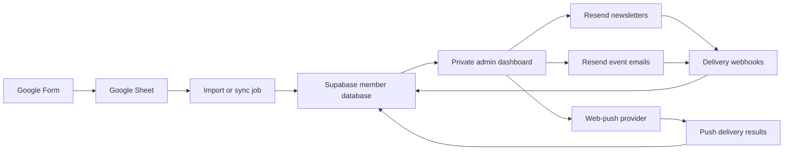
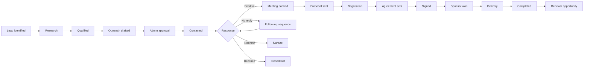
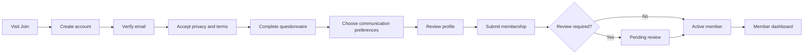
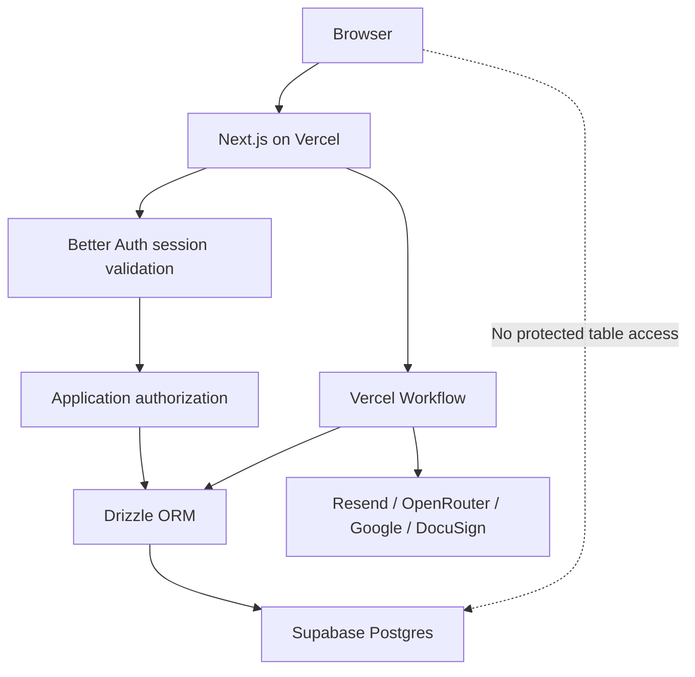

# Physical I/O Member Admin & Communications Plan

## Goal

Build a private admin application for managing Physical I/O members collected through the existing Google Form, creating newsletters, sending event email updates, and eventually delivering browser push notifications.

The proposed stack is:

- **Next.js** for the public site and private admin interface
- **Better Auth** for internal administrator authentication, sessions, invitations, and roles
- **Supabase Postgres** for member data, campaign records, outreach CRM data, permissions, and audit logs
- **Resend** for newsletters, event emails, contact preferences, and delivery webhooks
- **Google Sheets** as the initial signup intake source
- **OneSignal or another managed web-push provider** for browser push notifications

## Current State

- The project uses Next.js 15, React 19, and TypeScript.
- It is currently configured as a static export using `output: "export"`.
- The Google Sheet is titled **Physical I/O Signup Questionnaire (Responses)**.
- It has one response tab, **Form Responses 1**, with approximately 187 signup rows.
- The populated form fields are:
  - Timestamp
  - Full name
  - Email address
  - City
  - Professional role
  - Industry experience
  - Physical AI / Spatial Intelligence work areas
  - Company, portfolio, or GitHub link
  - LinkedIn link
  - Community goals
  - Preferred event formats
  - Community suggestions
- The form does not currently appear to capture explicit newsletter consent or browser-push consent.

## Recommended Architecture



Supabase should become the operational source of truth after import. Google Sheets should remain the raw signup source rather than being queried whenever an administrator opens the dashboard.

## Admin Application

### Dashboard

Show a concise overview of:

- Total active members
- New signups this week and month
- Members by city and professional role
- Newsletter subscribers
- Push subscribers
- Recent campaigns
- Email delivery, bounce, complaint, and unsubscribe rates
- Upcoming events
- Google Sheet sync status
- Invalid or rejected import rows

### Member Management

Create a searchable, filterable member table containing:

- Name and email
- City
- Role and experience
- Areas of interest
- Preferred event formats
- Membership status
- Email and push subscription status
- Signup date and source
- Tags
- Last contacted date
- Engagement summary

Member actions should include:

- View and edit a profile
- Add internal notes and tags
- Filter members and save reusable segments
- Import new Google Sheet responses
- Export a filtered CSV
- Archive or suppress a contact
- Review consent history
- Send an individual test or event message

Useful initial segments include:

- London members
- Founders and operators
- Designers
- Engineers and developers
- Robotics members
- AI/ML members
- Members interested in workshops
- Members interested in demo nights
- New members who have not received a welcome message

### Campaign Composer

Use one campaign workflow for:

- Newsletters
- Event updates
- Announcements
- Push notifications

Email composer features:

- Campaign name
- Subject and preview text
- Sender name and reply-to address
- Branded content blocks
- Image, button, divider, and event-card blocks
- First-name personalisation
- Audience selection and recipient count
- Desktop and mobile preview
- Send a test email
- Save as draft
- Schedule or send now
- Duplicate a previous campaign
- Final confirmation showing the exact audience and channel
- Delivery and engagement report

Resend Contacts, Properties, Segments, Topics, and Broadcasts should be used where practical so that unsubscribe handling and email preferences are not reimplemented unnecessarily.

### Event Management

Each event should support:

- Title
- Date and time
- Venue
- Description
- Registration URL
- Draft, published, or completed status
- Target audience segments
- Initial announcement
- Reminder sequence
- Last-minute venue or schedule update
- Post-event follow-up
- Campaign history

The first version can link to an external registration service. Native RSVP and attendance management can be added later.

### Browser Push Notifications

Browser push requires separate opt-in and is not provided directly by Supabase or Resend.

Recommended approach:

- Use OneSignal or another managed provider for the first release.
- Add a website permission and preference flow.
- Store the provider subscription ID and consent timestamp in Supabase.
- Send push messages from the same campaign composer.
- Support a title, short body, target URL, icon, test notification, and audience segment.
- Automatically remove expired or invalid subscriptions.

Push should be implemented after the email workflow is stable. Existing members cannot receive browser push until they revisit the website and explicitly opt in.

## Supabase Data Model

### `members`

- `id`
- `email`
- `email_normalized`
- `full_name`
- `first_name`
- `city`
- `professional_role`
- `experience_range`
- `website_url`
- `linkedin_url`
- `status`
- `source`
- `source_row`
- `signed_up_at`
- `created_at`
- `updated_at`

### `member_interests`

Normalized work areas, community goals, and preferred formats. Multi-select form answers should not remain as one unsearchable comma-separated value.

### `tags` and `member_tags`

Administrator-managed labels for segmentation and internal organization.

### `subscriptions`

- Member
- Channel
- Topic
- Status
- Consent timestamp
- Consent source
- Consent wording/version
- Unsubscribe timestamp

### `segments` and `segment_rules`

Saved dynamic filters used by campaigns.

### `campaigns`

- Campaign type
- Status
- Subject and preview text
- Content or template payload
- Target segment
- Scheduled time
- Sent time
- Created-by administrator
- Resend or push-provider identifiers

### `campaign_recipients`

Store the resolved audience and per-recipient delivery state. This makes campaign reporting reproducible even if a segment later changes.

### `campaign_events`

Webhook events such as delivered, bounced, complained, opened, clicked, and unsubscribed.

### Additional Tables

- `events`
- `email_templates`
- `push_subscriptions`
- `imports`
- `import_rows`
- `admin_profiles`
- `audit_log`

## Google Sheet Import Strategy

### Initial Import

1. Read all existing form responses.
2. Normalize email addresses to lowercase and trim whitespace.
3. Deduplicate by normalized email.
4. Preserve the earliest signup timestamp.
5. Merge later responses without losing original raw values.
6. Validate email addresses and URLs.
7. Record rejected rows for administrator review.
8. Preserve the source spreadsheet row for traceability.
9. Sync a member to Resend only when their subscription state permits it.

### Ongoing Sync

Start with an administrator-controlled **Sync signups** action. Once the import behavior has been validated, automate ingestion using a scheduled job or Google Apps Script webhook.

Admin edits should not write back into the Google Form response sheet. A two-way sync would create competing sources of truth.

## Authentication and Security

- Move the project away from static-only export so server authentication, protected routes, API endpoints, and webhooks can run.
- Deploying the Next.js application on Vercel is the simplest path.
- Use Better Auth for assigned internal administrators.
- Store Better Auth users, accounts, sessions, and role fields in the Supabase-hosted PostgreSQL database in a dedicated `better_auth` schema. Do not use Supabase's managed `auth` schema.
- Mount the Better Auth Next.js handler at `/api/auth/[...all]`.
- Protect `/admin`, server actions, API routes, Workflow controls, and webhook-management operations on the server by retrieving and validating the Better Auth session.
- Disable public administrator signup. Access should be invitation-only or restricted to a verified allowlist.
- Use the Better Auth Admin plugin with custom permissions for outreach roles.
- Keep lead assignment and domain-specific authorization in protected CRM tables; an auth role alone must not grant access to every lead.
- Never use client-editable profile fields for authorization.
- Use database-backed sessions so administrators can review and revoke active sessions.
- For sensitive operations, bypass any session cookie cache and revalidate the session and permissions against the database.
- Never expose the Supabase service-role key or Resend API key to browser code.
- Do not expose protected CRM tables through the browser-facing Supabase Data API.
- Enable RLS as defense in depth on any table that remains in an exposed schema, and deny `anon` and `authenticated` Data API access unless a separate public use case explicitly requires it.
- Access protected member and outreach data through authenticated Next.js server routes/actions using a server-only database connection.
- Limit member data access using Better Auth permissions plus explicit lead/team assignments.
- Record sensitive admin actions in `audit_log`.
- Rate-limit send and import endpoints.
- Use idempotency protection to prevent duplicate campaign sends.

### Better Auth Configuration

Recommended configuration:

- `BETTER_AUTH_URL` set to the deployed first-party application URL
- A high-entropy `BETTER_AUTH_SECRET`, with a documented rotation procedure using versioned secrets
- Same-origin signed, HTTP-only, secure cookies
- Better Auth Drizzle adapter connected to Supabase Postgres
- Better Auth schema generated and reviewed before migration
- Admin server and client plugins configured with the same custom permission definitions
- Short session lifetime appropriate for internal administration
- Immediate session revocation during administrator offboarding
- Optional Google OAuth for staff sign-in, restricted to invited email addresses
- Two-factor authentication required before enabling contract, finance, or user-management privileges

Suggested Better Auth permission resources:

- `member`: `read`, `update`, `export`
- `lead`: `read`, `create`, `update`, `assign`, `close`
- `message`: `draft`, `approve`, `send`
- `template`: `read`, `create`, `update`, `publish`
- `meeting`: `create`, `update`, `cancel`
- `resource`: `read`, `upload`, `share`
- `agreement`: `read`, `prepare`, `send`, `void`
- `delivery`: `read`, `update`, `complete`
- `workflow`: `read`, `start`, `resume`, `retry`, `cancel`
- `admin_user`: `invite`, `set_role`, `revoke_session`, `disable`

## Consent and Privacy

Before sending marketing communications broadly:

- Add explicit email-update consent to the Google Form.
- Add a privacy-notice link.
- Capture the consent timestamp and wording/version.
- Consider separate topics for newsletters, events, and community announcements.
- Require a separate browser permission flow for push notifications.
- Include unsubscribe and preference-management links in emails.
- Immediately suppress bounced, complained, and unsubscribed addresses.
- Support member data export and deletion requests.
- Define retention periods for rejected imports and campaign logs.

Existing members without explicit marketing consent should initially be marked `consent_unknown`. They should not be silently enrolled in every marketing channel. A carefully reviewed membership-related message can invite them to select communication preferences.

## Resend Integration

- Verify a Physical I/O sending domain.
- Configure SPF and DKIM records.
- Use a consistent sender and monitored reply-to address.
- Create branded React Email templates.
- Synchronize permitted members to Resend Contacts.
- Map relevant member data to contact properties.
- Use Topics for user-facing email preferences.
- Use Segments and Broadcasts for newsletters where appropriate.
- Include Resend's managed unsubscribe URL.
- Receive webhook events for delivery, bounce, complaint, and unsubscribe changes.
- Verify webhook signatures before accepting events.
- Update Supabase subscription and campaign state from each verified event.

## Delivery Phases

### Phase 1 — Foundation

- Remove the static-export-only constraint.
- Configure a server-capable deployment.
- Create the Supabase project and migrations.
- Add Better Auth, its PostgreSQL schema, invitation-only administrator access, and server-side route protection.
- Implement RLS and administrator roles.
- Import and deduplicate existing Google Sheet responses.
- Build the members table and member detail page.

### Phase 2 — Email Operations

- Configure and verify the sending domain in Resend.
- Add branded React Email templates.
- Synchronize permitted contacts to Resend.
- Build the newsletter and event-email composer.
- Add audience filters, previews, drafts, and test sends.
- Add send-confirmation safeguards.
- Process Resend webhooks.
- Build campaign reporting.

### Phase 3 — Events and Automation

- Build event records and campaign workflows.
- Add scheduled announcements and reminders.
- Automate Google Form response ingestion.
- Add a welcome or preference-confirmation workflow.
- Add import error reporting and retry controls.

### Phase 4 — Push Notifications

- Select and configure a managed push provider.
- Add public push opt-in UI and a service worker.
- Store subscriptions and consent evidence.
- Add push composition, segmentation, testing, and reports.
- Clean up expired subscriptions.

### Phase 5 — Hardening

- Complete the audit log.
- Add rate limiting and idempotent sending.
- Prevent duplicate scheduled jobs and campaign sends.
- Perform accessibility and responsive QA.
- Add backup and export workflows.
- Add end-to-end tests for authorization, imports, consent, unsubscribes, and scheduling.

## Recommended MVP

The first production release should include:

- Secure invitation-only Better Auth administrator login
- Member import and management
- Search, filters, tags, and saved segments
- Newsletter and event-email composer
- Test, send, and schedule workflows
- Resend unsubscribe and delivery tracking
- Events list with announcement and reminder actions
- Consent and suppression management

Browser push should follow as a separate release after email delivery and consent handling are proven.

## Decisions Needed Before Implementation

- Confirm Vercel as the server-capable deployment target.
- Confirm Google OAuth as the preferred Better Auth sign-in method, with email/password or magic link retained only if operationally required.
- Confirm the Physical I/O sending domain and sender address.
- Decide whether Resend Broadcasts or a fully custom campaign renderer should be the primary newsletter engine.
- Choose a managed browser-push provider.
- Review and approve the consent wording and privacy notice.
- Decide whether the Google Form remains the long-term signup interface or is later replaced by a native website form.

---

# Sponsor Outreach CRM & End-to-End Automation

## Outcome

Extend the private admin application into the central system for sponsor outreach. Assigned administrators should be able to manage the complete relationship—from a newly identified lead through personalised outreach, replies, meetings, proposals, paperwork, sponsorship delivery, and renewal—without coordinating the workflow across disconnected tools.

The dashboard and Supabase should remain the system of record. Internal durable workflows hosted on Vercel may execute automation, but they should never hold the only copy of a lead, activity, status, or decision.

## Sponsor Lifecycle



Recommended statuses:

- `new`
- `researching`
- `qualified`
- `ready_for_outreach`
- `draft_pending_approval`
- `contacted`
- `follow_up_due`
- `replied_positive`
- `replied_neutral`
- `replied_negative`
- `meeting_scheduled`
- `proposal_in_progress`
- `proposal_sent`
- `negotiation`
- `agreement_sent`
- `signed`
- `sponsor_won`
- `delivery_in_progress`
- `delivery_complete`
- `nurture`
- `closed_lost`
- `renewal_due`

Every status change should record the previous value, new value, administrator, timestamp, and optional reason. Automations may recommend or apply low-risk changes, but administrators must be able to correct them.

## Outreach Dashboard

### Pipeline View

Provide both Kanban and table views with:

- Lead or organisation
- Primary contact
- Owner
- Sponsorship fit score
- Current status
- Estimated sponsorship value
- Last activity
- Next action and due date
- Reply state
- Meeting state
- Proposal and agreement state
- Delivery health

Allow administrators to filter by owner, status, industry, location, value, event, next-action date, engagement, and data source.

### Lead Workspace

Each lead should have one workspace containing:

- Organisation profile and website
- Contact details and role
- Relationship owner and assigned collaborators
- Research notes and source links
- AI-generated summary and sponsorship-fit rationale
- Email and meeting timeline
- Tasks and next actions
- Drafts and approved messages
- Shared resources
- Meetings and notes
- Proposals and sponsorship packages
- DocuSign envelopes
- Commercial value and expected close date
- Sponsorship deliverables
- Full audit history

### Unified Conversation Timeline

The timeline should show:

- Outbound emails
- Inbound replies
- Drafts and approvals
- Delivery, bounce, open, and click events
- Internal notes
- Status changes
- Tasks and reminders
- Google Meet bookings
- Shared resources
- Proposal changes
- DocuSign events
- Sponsor-delivery milestones

Replies should be linked using standard email identifiers such as `Message-ID`, `In-Reply-To`, and `References`, with sender, recipient, and subject matching as a controlled fallback. Do not depend on opens as a reliable sign of interest; replies, meetings, and explicit actions are stronger signals.

## Access Control

Outreach data must only be accessible to assigned internal administrators.

Recommended roles:

- **Outreach admin:** full lead, communication, meeting, and task management
- **Outreach contributor:** manage assigned leads and create drafts, but cannot send or change commercial closure fields
- **Approver:** approve sends, proposals, and sensitive AI-generated content
- **Finance/legal:** access commercial terms and agreement records without broader campaign administration
- **Viewer:** read-only access to explicitly assigned leads

Authorization should combine role and assignment. Being authenticated must not automatically grant access to every outreach record.

Required safeguards:

- Protected outreach tables unavailable to browser-side Supabase Data API clients
- RLS deny-by-default on any outreach table kept in an exposed schema
- Server-side authorization for every action
- Better Auth Admin plugin roles with custom typed permissions
- Domain assignments stored in protected CRM tables and evaluated in addition to the Better Auth role
- Per-lead assignment policies
- Separate permission for sending email
- Separate permission for initiating DocuSign paperwork
- Separate permission for marking a sponsor won or lost
- Audit log for reads of sensitive commercial data and all mutations
- Better Auth session revocation and account disablement when internal access is removed
- No service-role, Resend, OpenRouter, Workflow, Google, or DocuSign secrets in browser code

## Lead Data Model

### Core CRM Tables

- `organisations`
- `contacts`
- `leads`
- `lead_contacts`
- `lead_assignments`
- `lead_status_history`
- `lead_scores`
- `lead_notes`
- `tasks`
- `activity_events`

An organisation can have several contacts and several opportunities over time. Do not make the contact record itself the sponsorship opportunity.

### Communication Tables

- `outreach_threads`
- `outreach_messages`
- `message_recipients`
- `message_drafts`
- `message_approvals`
- `email_templates`
- `template_versions`
- `follow_up_sequences`
- `sequence_steps`
- `sequence_enrolments`
- `delivery_events`
- `reply_classifications`

Store rendered email content as an immutable snapshot when sent. Later edits to a template must not change the historical record.

### Meetings and Resources

- `meetings`
- `meeting_attendees`
- `meeting_notes`
- `resources`
- `lead_resources`
- `resource_access_events`

Resources may be:

- Google Drive links
- Public website links
- Supabase Storage files
- Sponsorship decks
- Rate cards
- Event information
- Case studies
- Draft proposals

Each resource should include its owner, visibility, version, expiry policy, and whether it may be sent externally. Sensitive files should use time-limited signed URLs or explicitly shared Drive permissions rather than permanent public links.

### Commercial and Delivery Tables

- `sponsorship_opportunities`
- `sponsorship_packages`
- `proposals`
- `proposal_versions`
- `agreements`
- `agreement_events`
- `sponsorship_deliverables`
- `deliverable_updates`
- `payments` or external finance references
- `renewal_opportunities`

## AI Personalisation with OpenRouter

OpenRouter should generate drafts and structured recommendations, not autonomously contact leads in the first release.

### Inputs

The draft-generation service may receive only approved data:

- Contact name, role, and organisation
- Organisation description and approved research notes
- Sponsorship-fit rationale
- Previous conversation summary
- Relevant Physical I/O event or package
- Selected resources
- Desired tone and call to action
- Approved factual claims and exclusions
- Chosen template

Avoid sending unnecessary personal data, private attachments, legal documents, or entire mailbox histories to a model.

### Structured Output

Require a JSON-schema response containing fields such as:

- `subject`
- `preview_text`
- `opening_line`
- `body_markdown`
- `call_to_action`
- `personalisation_facts_used`
- `claims_requiring_review`
- `suggested_follow_up_date`
- `confidence`

Use an OpenRouter model that supports structured output and require supported parameters. Store the model identifier, prompt version, input references, output, token usage, cost, generating administrator, and approval decision.

### AI Guardrails

- Never invent prior relationships, achievements, attendance, budgets, or company initiatives.
- Personalisation facts must link back to a saved source.
- Flag unsupported claims rather than smoothing over missing information.
- Do not generate sensitive-trait personalisation.
- Show a visible comparison between template text, AI additions, and administrator edits.
- Require human approval before every first-contact email.
- Keep automatic follow-ups constrained to pre-approved templates and pause immediately on reply, bounce, unsubscribe, meeting booking, or manual hold.
- Provide a global AI kill switch and per-lead automation pause.

## Email Sending and Reply Tracking

### Recommended Channel

Use a dedicated sending and receiving subdomain, for example `outreach.physical-io.com`, so outreach processing does not interfere with the organisation's normal mailbox configuration.

Resend can provide:

- Outbound sending
- Scheduled emails
- Delivery webhooks
- Inbound email webhooks
- Retrieval of received content and attachments
- Thread correlation using standard message headers

The dashboard should send with a unique reply-capable address or alias that can be mapped back to the lead and thread. A reply webhook should:

1. Verify the webhook signature.
2. Store the event idempotently.
3. Retrieve the full inbound message.
4. Scan and validate attachments before storage.
5. Match the reply to its thread.
6. Pause active follow-up sequences.
7. Classify intent as positive, neutral, negative, out-of-office, referral, or unknown.
8. Create an administrator review task.
9. Recommend a status update without silently closing the lead.

If the team wants replies to remain in an existing Gmail mailbox, use Gmail forwarding or a Gmail API integration. Avoid running two independent reply sources without a deduplication strategy.

## Google Meet Scheduling

The dashboard should create Google Calendar events with Google Meet links through an authorized internal calendar connection.

Meeting workflow:

1. Administrator selects the lead and attendees.
2. Dashboard checks the assigned owner's availability.
3. Administrator selects an exact timezone-aware slot.
4. Dashboard creates the Calendar event and Meet conference.
5. Event details and Meet URL are stored against the lead.
6. Confirmation and reminder emails are logged in the outreach timeline.
7. Rescheduling and cancellation update both Calendar and the CRM.
8. After the meeting, create a notes and next-action task.

Do not let an automation invent meeting times. Availability and conflicts should be checked against Google Calendar before creating an event.

## Templates and Personalisation

Templates should be versioned and organised by purpose:

- First introduction
- Warm introduction
- Event sponsorship
- Community partnership
- Venue partnership
- Product or technology partnership
- Follow-up 1
- Follow-up 2
- Meeting confirmation
- Proposal follow-up
- Agreement reminder
- Sponsor onboarding
- Deliverable update
- Renewal outreach

Each template should support:

- Required and optional variables
- Approved tone
- Allowed sender identities
- Relevant sponsorship package
- Default attachments or resources
- Follow-up timing
- Legal or compliance footer
- Approval requirement
- Active/inactive status
- Test rendering

Missing variables must block sending rather than appearing as empty placeholders.

## Shared Resources

Administrators should be able to upload or select resources from the lead workspace and attach them to a draft.

Recommended behavior:

- Store general collateral in a managed Drive folder or Supabase Storage bucket.
- Save metadata and permissions in Supabase.
- Display file type, version, owner, size, and last-updated date.
- Allow reusable resource bundles for common sponsorship packages.
- Require confirmation before sending confidential material.
- Log which resource version was sent to which contact.
- Prefer secure links for large documents rather than duplicate email attachments.
- Revoke or expire access when appropriate.

## DocuSign Workflow

Start with a controlled DocuSign deep-link workflow, then add full API automation after the commercial process is stable.

### Initial Version

- Generate an approved proposal or agreement record.
- Store the document's Drive or Storage location.
- Open the correct DocuSign template or envelope workflow.
- Allow an authorized administrator to complete and send it.
- Save the envelope id and status link in the CRM.
- Update agreement status manually or through an internal workflow.

### Full Integration

- Create envelopes from approved templates.
- Map signers and commercial fields.
- Receive verified DocuSign status webhooks.
- Store sent, delivered, viewed, signed, declined, and voided events.
- Save the completed document securely.
- Mark a sponsor won only after the required signature and internal approval conditions are met.

Never allow AI-generated legal language to bypass an approved template or legal review.

## Internal Automation with Vercel Workflow

Use Vercel Workflow DevKit as the durable orchestration layer. Workflows should run inside the Next.js application, use Supabase as persistent business state, and expose their progress in the outreach dashboard.

Keeping orchestration inside the application gives the team direct control over permissions, retries, approval waits, schedules, observability, and data retention.

### Workflow Design Rules

- Use `"use workflow"` functions only for durable orchestration.
- Put Supabase, Resend, OpenRouter, Google Calendar, Drive, and DocuSign API calls in `"use step"` functions.
- Make every external step idempotent and safe to retry.
- Use durable `sleep()` for follow-up delays rather than cron records or in-memory timers.
- Use hooks to pause for administrator approval, inbound replies, meeting bookings, and agreement events.
- Store each Workflow run ID on the related lead, sequence enrolment, meeting, or agreement.
- Mirror important workflow state and business outcomes into Supabase so the CRM remains queryable without replaying workflow internals.
- Treat permanent validation and permission failures as fatal; retry only transient provider, network, and rate-limit failures.
- Allow authorized administrators to pause, resume, or cancel an automation from the lead workspace.
- Stream concise run progress to the dashboard and keep verbose diagnostic logs separate.

### Lead Capture Workflow

- Start: approved form submission, spreadsheet import, or manual lead creation
- Steps: normalize → deduplicate → create/update organisation and contact → create lead → assign owner → create research task
- Result: lead and workflow run are linked in Supabase

### Draft Preparation Workflow

- Start: status becomes `ready_for_outreach`
- Steps: gather approved context → request structured OpenRouter draft → validate sources and variables → save draft → notify approver
- Pause: wait on a deterministic approval hook
- Branch: approved → continue to send; rejected → return to editing; expired → create review task

### Approved Send Workflow

- Resume: authorized administrator approves the draft in the dashboard
- Steps: re-check permissions and stop conditions → render immutable message → send through Resend → save provider and Message-ID values → update status
- Continue: durably sleep until the next follow-up date while also waiting for stop events

### Reply Handling Workflow

- Start/resume: verified Resend inbound webhook or Gmail event
- Steps: store message idempotently → match thread → signal the active sequence hook → classify reply → notify owner → create next-action task
- Result: active follow-ups stop before another send can occur

### Meeting Booking Workflow

- Start: meeting confirmed in the dashboard
- Steps: re-check availability → create Calendar event and Meet link → store details → send/log confirmation → update lead status → schedule reminder and follow-up tasks
- External reschedules or cancellations resume the workflow through verified event endpoints

### Follow-Up Sequence Workflow

- Start: first outreach is successfully sent
- Loop: durably sleep until a sequence step is due
- Before each step: re-read the lead and verify no reply, bounce, unsubscribe, meeting, negotiation, agreement, manual pause, or closure occurred
- Steps: create draft → request approval when required → send only if the step is pre-approved and all stop conditions pass
- Stop: receive a reply/meeting/pause hook, reach a terminal lead status, exhaust the sequence, or hit a safety limit

### Agreement Workflow

- Start: authorized administrator initiates paperwork
- Steps: create or link envelope → store envelope identifiers → wait for verified DocuSign events → update agreement → notify owner
- Result: update opportunity status and start delivery onboarding only when required signatures and internal closure checks are satisfied

### Sponsor Delivery Workflow

- Start: opportunity becomes `sponsor_won`
- Steps: instantiate deliverable checklist → assign owners → schedule durable milestone reminders → monitor completion → create sponsor reporting and renewal tasks
- Escalate: notify owners when a deliverable is overdue or at risk

### Workflow Runtime Records

Add a `workflow_runs` table containing:

- Workflow run ID
- Workflow type and version
- Lead, opportunity, meeting, or agreement reference
- Status
- Started, waiting, resumed, completed, failed, and cancelled timestamps
- Current business step
- Next wake time
- Waiting hook type
- Retry count
- Last safe error summary
- Initiating administrator or system event
- Correlation and idempotency keys

Every workflow start or resume must include:

- Authenticated and authorized initiator
- Idempotency key
- Source event id
- Correlation id
- Lead or opportunity id
- Retry-safe behavior
- Success/failure log
- Manual-review path for exhausted retries or ambiguous external events

### Workflow Operations in the Dashboard

Administrators should be able to:

- See active, sleeping, waiting, failed, completed, and cancelled runs
- Open a run from its related lead
- See the current business step and next wake time
- Identify which approval or external event is awaited
- Retry an explicitly safe failed step
- Resume a paused run when authorized
- Cancel a sequence or delivery workflow
- View a redacted error summary
- Create a manual-review task from a failure

Workflow operations must not expose secrets, raw tokens, private prompt payloads, or sensitive provider responses.

## Closing and Sponsorship Delivery

Winning a sponsor should create an operational delivery workspace rather than ending the pipeline.

Track:

- Sponsorship package and final value
- Contract and signature status
- Invoice/payment reference
- Event or campaign covered
- Brand assets received
- Logo placement
- Social posts
- Newsletter inclusion
- Speaking or demo slots
- Tickets and guest allocation
- Venue or equipment commitments
- Reporting obligations
- Delivery owner and deadlines
- Evidence of completion
- Sponsor feedback
- Renewal date and recommended next action

An opportunity may move to `sponsor_won` only when required closure conditions are satisfied. Delivery should have its own health state: on track, at risk, blocked, or complete.

## Automation Safety Rules

- No autonomous first-contact sends.
- No automatic send when required personalisation facts lack sources.
- No send to bounced, unsubscribed, suppressed, or manually blocked contacts.
- Pause all sequences immediately when a human reply arrives.
- Pause on meeting booking, active negotiation, agreement sent, or sponsor won.
- Enforce per-domain and per-day sending limits.
- Use business-hours and timezone-aware schedules.
- Require approval for attachments, commercial claims, pricing, and legal content.
- Never infer agreement acceptance from an email open or link click.
- Verify all external webhooks and store them idempotently.
- Provide manual override, automation pause, and emergency stop controls.

## Outreach Implementation Phases

### Outreach Phase 1 — CRM Foundation

- Add organisations, contacts, leads, assignments, statuses, tasks, and activity timeline.
- Implement assigned-admin RLS and role permissions.
- Build pipeline and lead workspace views.
- Add manual notes, status updates, tasks, and resource links.

### Outreach Phase 2 — Email and Replies

- Configure dedicated sending/receiving domain.
- Add versioned templates and immutable sends.
- Build draft, review, approval, test, and send workflows.
- Add Resend delivery and inbound webhooks.
- Implement reply threading and sequence stop conditions.

### Outreach Phase 3 — AI and Automation

- Add OpenRouter structured draft generation.
- Add source-backed personalisation and claims review.
- Add Vercel Workflow to the Next.js runtime.
- Build durable lead capture, draft preparation, approval, send, reply, meeting, and follow-up workflows.
- Add hooks for human approval and verified external events.
- Add workflow-run monitoring, cancellation, retry, and manual-review controls.

### Outreach Phase 4 — Meetings and Proposals

- Add Google Calendar availability and Meet creation.
- Add meeting notes and next-action workflows.
- Add sponsorship packages, proposal versions, and shared resource bundles.

### Outreach Phase 5 — Agreements and Delivery

- Add DocuSign deep links and envelope records.
- Add DocuSign API and verified status webhooks when ready.
- Add sponsorship closure rules.
- Create deliverable tracking, evidence, reporting, and renewal workflows.

## Outreach MVP

The recommended first outreach release includes:

- Assigned-admin access
- Organisation, contact, and lead records
- Pipeline and lead timeline
- Manual and AI-assisted personalised drafts
- Human approval before sending
- Resend outbound email and inbound reply tracking
- Versioned templates
- Follow-up tasks with automatic pause on reply
- Google Meet creation from the lead workspace
- Shared resource links and bundles
- Proposal and DocuSign status links
- Sponsor-won conversion and delivery checklist
- Vercel Workflow run history and automation controls

Full automatic sequences, embedded DocuSign API actions, advanced lead scoring, and renewal prediction should follow after the core workflow has proven reliable.

---

# First-Party Member Signup, Onboarding & Dashboard

## Outcome

Replace the Google Form with a first-party questionnaire and onboarding experience inside the Physical I/O website. New members will create a verified account, complete their profile and preferences, and write directly to Supabase Postgres through authenticated Next.js server actions.

Members will then have a private dashboard for maintaining their profile, communication preferences, events, resources, and community activity. The existing Google Sheet becomes a migration source and temporary fallback, not the long-term signup system.

## Identity Model

Use one Better Auth deployment for both members and internal administrators, with different roles, permissions, entry points, and onboarding rules.

### Member Access

- Public registration is available through `/join`.
- Email ownership must be verified before a membership becomes active.
- Google OAuth may be offered as a convenient sign-in method.
- New accounts receive only the `member` role.
- A member can access only their own profile, preferences, registrations, files, and messages intended for them.
- Registering as a member must never grant access to `/admin` or outreach data.

### Administrator Access

- Administrator access remains invitation-only.
- Admin roles are assigned by an existing authorized administrator.
- Admin permissions remain separate from member status.
- A person may be both a member and an administrator, but elevated permissions must be explicit and auditable.
- Sensitive admin actions should force a fresh database-backed session check and, where configured, two-factor authentication.

## Member Journey



Recommended membership states:

- `account_created`
- `email_verification_pending`
- `onboarding_in_progress`
- `profile_incomplete`
- `pending_review`
- `active`
- `paused`
- `suspended`
- `archived`

Authentication state and membership state must remain separate. A valid session does not imply an active membership.

## Signup and Questionnaire Front End

### Route Structure

- `/join` — introduction, expectations, and account creation
- `/verify-email` — verification instructions and resend action
- `/onboarding` — resumable multi-step questionnaire
- `/onboarding/review` — final review and consent confirmation
- `/member` — private member dashboard
- `/member/profile` — profile editing
- `/member/preferences` — email, push, privacy, and visibility preferences
- `/member/events` — event registrations and updates
- `/member/resources` — member resources and saved links
- `/member/security` — sessions, sign-in methods, and account controls

### Questionnaire Steps

#### 1. Basic Profile

- Full name
- Preferred name
- City and country
- Timezone
- Profile image, optional
- Short introduction, optional

#### 2. Professional Background

- Primary role
- Years of experience
- Organisation
- Job title
- Company, portfolio, or GitHub URL
- LinkedIn URL
- Student or professional status where relevant

#### 3. Physical AI Interests

- Physical AI
- Robotics
- Spatial intelligence
- Embodied AI
- Wearables
- Intelligent hardware
- Human-computer interaction
- Computer vision
- Industrial design
- Design engineering
- Other interests

#### 4. Current Work

- What the member is building, researching, or learning
- Project stage
- Skills they can offer
- Skills or collaborators they are looking for
- Whether they are open to mentoring, speaking, hiring, or collaboration

#### 5. Community Goals

- Learning from talks and demos
- Meeting collaborators or co-founders
- Hiring or finding work
- Showcasing a project
- Staying current with the field
- Finding investment or commercial partners
- Other goals

#### 6. Participation Preferences

- In-person meetups
- Demo nights
- Talks and panels
- Hands-on workshops
- Socials and networking
- Online community
- Speaking or presenting interest
- Volunteering interest

#### 7. Communication and Privacy

- Essential membership email acknowledgement
- Optional newsletter consent
- Optional event-update consent
- Optional partner or opportunity communications
- Optional browser-push interest; actual browser permission is requested later in context
- Member-directory visibility
- Which profile fields may be visible to other members
- Privacy notice and terms acceptance with version and timestamp

Consent choices must not be preselected. Essential service messages and optional marketing topics must be clearly distinguished.

### Form Behavior

- Save progress after every step.
- Allow members to leave and resume on another device.
- Validate on the client for usability and again on the server for trust.
- Use stable option identifiers rather than storing display labels as database values.
- Preserve the questionnaire/version used for each submission.
- Show progress, estimated completion time, and clear back/continue controls.
- Make every step keyboard-accessible and mobile-friendly.
- Prevent duplicate submission with idempotency keys.
- Never expose direct database credentials or privileged Supabase keys.
- Write through authenticated server actions or route handlers.
- Provide a final review screen before activation.
- Store partial drafts separately from the accepted member profile.

## Member Dashboard

### Dashboard Home

Show:

- Welcome and membership status
- Profile-completion indicator
- Upcoming Physical I/O events
- Recent announcements
- Recommended resources
- Pending actions
- Communication preference summary
- Quick links to edit profile or register for an event

### Profile

Members should be able to:

- Update personal and professional information
- Maintain interests, skills, and collaboration goals
- Change links and biography
- Upload or replace a profile image
- Preview what other members can see
- See when their profile was last updated

Sensitive changes such as primary email should use Better Auth's verified email-change flow rather than directly updating the CRM row.

### Preferences

Members should be able to:

- Subscribe or unsubscribe from each email topic
- Manage push-notification subscriptions
- Choose member-directory visibility
- Control field-level profile visibility
- Pause nonessential communications
- Review consent history
- Download their data
- Request account and profile deletion

Preference changes should update Supabase immediately and then synchronize to Resend through an idempotent Vercel Workflow.

### Events

The member event area should support:

- Upcoming and past events
- Registration status
- Registration and cancellation
- Calendar file or Google Calendar link
- Google Meet or venue details when permitted
- Reminder preferences
- Post-event resources
- Feedback forms

Native event registration can be introduced after the member account foundation. Until then, event cards may link to an approved external registration page while still recording click or interest state where consent permits.

### Resources

Provide access to:

- Event recordings and slides
- Community guides
- Sponsorship or partner resources intended for members
- Shared project links
- Saved resources

Every resource needs a visibility level such as public, active members, selected segment, event attendees, or administrators only.

### Security and Account

Members should be able to:

- View active sessions
- Revoke other sessions
- Review sign-in methods
- Add or remove supported providers safely
- Change password when password authentication is enabled
- Enable two-factor authentication when offered
- Request data export
- Request account deletion

## Member Data Model Extensions

### `member_profiles`

- `id`
- `auth_user_id` referencing the Better Auth user
- `legacy_member_id`, nullable
- `membership_status`
- `preferred_name`
- `city`
- `country_code`
- `timezone`
- `bio`
- `organisation`
- `job_title`
- `professional_role`
- `experience_range`
- `website_url`
- `linkedin_url`
- `profile_image_path`
- `directory_visibility`
- `onboarding_completed_at`
- `last_profile_reviewed_at`
- `created_at`
- `updated_at`

Do not duplicate Better Auth's authoritative email address or sign-in credentials in editable profile fields. A normalized email may be retained in a controlled reconciliation table or synchronized read model when operationally necessary.

### Onboarding Tables

- `onboarding_submissions`
- `onboarding_answers`
- `onboarding_versions`
- `onboarding_progress`
- `membership_status_history`

Keep draft answers separate until final submission. On completion, validate the whole questionnaire transactionally and update the canonical member profile and related interest records.

### Profile Taxonomy Tables

- `interest_options`
- `member_interests`
- `skill_options`
- `member_skills`
- `goal_options`
- `member_goals`
- `participation_options`
- `member_participation_preferences`

This allows administrators to rename display labels without corrupting historical data or filters.

### Privacy and Consent Tables

- `consent_definitions`
- `member_consents`
- `profile_visibility_rules`
- `data_requests`

Each consent record should include the member, purpose, status, source, notice version, capture timestamp, withdrawal timestamp, and relevant evidence.

### Member Activity Tables

- `event_registrations`
- `member_saved_resources`
- `member_notifications`
- `member_notification_reads`
- `member_activity_events`

Activity data should be minimal, purpose-limited, and governed by a retention policy.

## Existing Google Form Migration

The current Google Sheet should be imported before the first-party onboarding launch.

### Claiming an Existing Profile

1. Existing member creates a Better Auth account using the same email address recorded in the Sheet.
2. The email address is verified.
3. The server searches the controlled legacy-member reconciliation table by normalized verified email.
4. If exactly one safe match exists, the member is invited to review and claim that profile.
5. The member confirms and updates the imported answers.
6. The system links the Better Auth user to the existing member profile.
7. The claim and source rows are recorded in the audit trail.

Do not auto-link on an unverified email, and do not expose whether an arbitrary email already exists in the member database. Ambiguous or conflicting matches should create a private administrator review task.

### Migration Cutover

1. Import and validate all Sheet responses.
2. Launch account claiming for existing members.
3. Release the first-party `/join` flow for new members.
4. Keep the Google Form read-only or clearly marked as retired.
5. Monitor both sources during a short, defined cutover window.
6. Remove the Google Form from public navigation.
7. Retain the original export according to the data-retention policy.

After cutover, no new application should depend on Google Sheets as an operational database.

## Member Authorization Boundary

Because Better Auth manages identities outside Supabase Auth, member sessions do not automatically populate Supabase's `auth.uid()`.

Therefore:

- Member dashboard data should be loaded through authenticated Next.js server components, server actions, or route handlers.
- Every server operation must derive the Better Auth user id from the server-side session.
- Ownership checks must use that derived id, never a user id submitted by the browser.
- Protected member tables should not be available through the browser-facing Supabase Data API.
- RLS should deny public Data API access to protected tables as defense in depth.
- Server queries should select and mutate only rows owned by the authenticated member unless an explicit administrator permission applies.
- Admin routes must separately validate Better Auth admin permissions; being a member is insufficient.

## Member Onboarding Workflows

### Registration Workflow

- Better Auth creates the account.
- Verification email is sent.
- After verification, create or locate the onboarding draft idempotently.
- Check privately for a claimable legacy profile.
- Record onboarding start and version.

### Onboarding Completion Workflow

- Revalidate every answer on the server.
- Store consent evidence.
- Create or update normalized profile relations.
- Link a verified legacy record when explicitly claimed.
- Set membership state to `active` or `pending_review`.
- Synchronize allowed topics to Resend.
- Send a welcome email.
- Create an internal review task only when rules require it.

### Preference Sync Workflow

- Start when a member changes communication preferences.
- Persist the local preference first.
- Synchronize it to Resend Topics.
- Retry transient provider failures.
- Show sync state without reverting the member's local withdrawal choice.
- Suppress optional messages immediately when consent is withdrawn, even if provider synchronization is delayed.

### Account Deletion Workflow

- Reauthenticate the member.
- Show the consequences and any retention obligations.
- Revoke active sessions.
- Stop optional communications and push subscriptions.
- Remove or anonymize eligible profile and activity data.
- Retain only legally required operational records with restricted access.
- Record completion without retaining unnecessary deleted content.

## Abuse Prevention

- Rate-limit signup, email verification, password reset, and profile-claim endpoints.
- Add bot protection to public registration and onboarding submission.
- Prevent account enumeration through error messages.
- Validate and normalize URLs and free-text fields.
- Scan uploaded images and enforce file size/type limits.
- Moderate public-facing biography and directory fields before wider directory features launch.
- Block disposable or obviously invalid addresses when appropriate without excluding legitimate users arbitrarily.
- Add administrator suspension controls and a member appeal/contact path.

## Delivery Phases

### Member Phase 1 — Identity and Migration

- Configure Better Auth member registration and email verification.
- Keep administrator enrollment invitation-only.
- Add member/admin permission separation.
- Import Google Sheet profiles into normalized member tables.
- Build safe verified-email profile claiming.

### Member Phase 2 — First-Party Onboarding

- Build `/join` and the resumable questionnaire.
- Add server-side validation and draft persistence.
- Add consent and privacy controls.
- Add final review and membership activation.
- Replace the public Google Form link.

### Member Phase 3 — Dashboard Foundation

- Build member dashboard home.
- Add profile and preference management.
- Add session and account controls.
- Add data export and deletion request flows.
- Add Resend preference synchronization.

### Member Phase 4 — Events and Resources

- Add event discovery and registration.
- Add reminders and calendar links.
- Add member-scoped resources and saved items.
- Add post-event materials and feedback.

### Member Phase 5 — Community Features

- Add an opt-in member directory.
- Add collaboration and speaking indicators.
- Add member-to-member connection requests with privacy controls.
- Add recommendations only after sufficient consent, moderation, and safety controls exist.

## Recommended Member MVP

- Better Auth account registration and verified email
- Existing-member profile claim by verified email
- Resumable multi-step questionnaire
- Direct server-side database persistence
- Explicit consent and privacy choices
- Member dashboard home
- Profile editing
- Communication-preference management
- Account/session controls
- Upcoming events and member resources
- Strict separation between member and admin permissions

The member directory, recommendations, messaging between members, and advanced community matching should be later releases rather than part of the initial onboarding launch.

---

# Selected Database & Authentication Architecture

## Architecture Decision

Use **Better Auth with Supabase-hosted PostgreSQL and server-only application data access**.

This is the selected approach for the first production release:

- Better Auth owns identity, email verification, OAuth accounts, credentials, sessions, two-factor state, authentication roles, and authentication permissions.
- Supabase hosts PostgreSQL, Storage, backups, observability, and local/preview database tooling.
- Drizzle ORM provides typed application queries and the Better Auth database adapter.
- Supabase SQL migrations are the only production database migration history.
- Next.js server components, server actions, and route handlers validate Better Auth sessions and perform all protected queries.
- Vercel Workflow steps use server-only database connections for durable automation.
- Protected member, admin, outreach, agreement, and sponsorship tables are not exposed to browser-side Supabase Data API clients.
- Application authorization combines Better Auth permissions, resource ownership, membership state, and explicit lead/team assignment.



## How Better Auth and Supabase Work Together

Better Auth uses the Supabase PostgreSQL database as its persistence layer. Supabase Auth is not used.

Better Auth is authoritative for:

- User ID
- Primary email
- Email verification
- Password credentials
- OAuth identities and tokens
- Sessions
- Authentication roles and permissions
- Two-factor authentication state

Application tables are authoritative for:

- Membership status
- Member profile and onboarding answers
- Interests, skills, goals, and participation preferences
- Consent and communication preferences
- Event registration and resources
- Admin assignments
- Leads, contacts, messages, and tasks
- Proposals, agreements, sponsorships, and delivery
- Workflow and audit records

The canonical relationship is:

```text
better_auth.user.id
        │
        ├── app.member_profiles.auth_user_id
        ├── outreach.lead_assignments.admin_user_id
        ├── outreach.messages.created_by_user_id
        └── audit.events.actor_user_id
```

Do not store passwords or OAuth credentials in application tables. Do not allow members to directly edit a duplicate copy of their Better Auth primary email.

## Selected Authorization Option — Server-Only Access

Better Auth sessions do not automatically populate Supabase Auth's `auth.uid()`. Standard Supabase ownership policies based on `auth.uid()` therefore do not identify Better Auth users.

For the selected approach:

1. The browser sends the Better Auth session cookie to Next.js.
2. The server validates the session.
3. The server derives the user ID from the validated session.
4. The server checks authentication permissions and application-level ownership or assignment.
5. The server runs a narrowly scoped database query.
6. Sensitive reads and mutations are recorded in the audit log.

Rules:

- Never accept an authoritative user ID, admin ID, owner ID, or role from browser input.
- Every ownership predicate must use the user ID derived from the server session.
- A valid login does not imply active membership.
- A member role does not grant administrator access.
- An administrator role does not automatically grant access to every outreach lead.
- Sensitive actions must revalidate the database-backed session and current permissions.
- Protected schemas must not be granted to Supabase `anon` or `authenticated` Data API roles.
- RLS should be deny-by-default on protected tables if they are ever placed in an exposed schema.

## Alternative Options Considered

### Option A — Server-Only Access

**Status: selected.**

Advantages:

- One authentication system
- Clear authorization boundary
- No custom JWT bridge
- Compatible with member, admin, outreach, Workflow, and webhook operations
- Protected database is not directly reachable from browser clients
- Easier auditing and permission enforcement

Tradeoffs:

- All protected data passes through Next.js
- Server queries must consistently apply ownership and assignment checks
- Database-level RLS does not automatically know the Better Auth user

### Option B — Custom PostgreSQL RLS Identity Propagation

The server would open a transaction, set a trusted transaction-scoped Better Auth user identifier, and use custom RLS policies that read that identifier.

**Status: deferred.**

Potential benefits:

- Additional database-level ownership enforcement
- Defense against an accidentally broad application query

Reasons to defer:

- More complex transaction management
- Additional testing with serverless transaction pooling
- Easy to implement incorrectly if identity context leaks between pooled connections
- Still requires server-side session validation

Reconsider this option for highly sensitive finance, agreement, or cross-team data after the core system is stable.

### Option C — Supabase-Compatible JWT Bridge

Better Auth would issue or exchange tokens that the Supabase Data API could interpret for RLS.

**Status: not recommended for the MVP.**

Reasons:

- Introduces a second token and authorization model
- Adds claim synchronization and expiry complexity
- Increases the chance of stale or unsafe permissions
- Makes session revocation and debugging harder
- Provides little benefit when the application already requires server workflows and privileged integrations

## PostgreSQL Schema Layout

Use schemas to separate ownership and exposure:

```text
better_auth   Better Auth users, accounts, sessions, verification, plugins
app           Members, onboarding, preferences, events, resources
outreach      Organisations, contacts, leads, messages, agreements, delivery
automation    Workflow runs, provider events, idempotency and retries
audit         Immutable or append-only security and activity records
public        Only deliberately public or Data-API-exposed objects
storage       Supabase-managed Storage metadata
```

Do not put Better Auth tables in Supabase's managed `auth` schema.

## Database Tooling

### Runtime ORM

Use Drizzle ORM for:

- Typed PostgreSQL schemas
- Type-safe queries
- Better Auth's official Drizzle adapter
- Relationships between Better Auth users and application records
- Reusable query functions with enforced authorization predicates

Recommended code structure:

```text
lib/
  auth/
    auth.ts
    auth-client.ts
    permissions.ts
    require-session.ts
  db/
    client.ts
    schemas/
      better-auth.ts
      members.ts
      outreach.ts
      campaigns.ts
      automation.ts
      audit.ts
    queries/
      members.ts
      outreach.ts
      permissions.ts
      workflows.ts
```

Centralize protected queries. UI components and route handlers should not build ad hoc authorization-sensitive queries throughout the codebase.

### Canonical Migration System

Use Supabase CLI SQL migrations as the only deployment history:

```text
supabase/
  config.toml
  migrations/
    <timestamp>_create_better_auth_schema.sql
    <timestamp>_create_member_profiles.sql
    <timestamp>_create_onboarding.sql
    <timestamp>_create_outreach_crm.sql
    <timestamp>_create_permissions.sql
  seed.sql
```

Rules:

- Create migrations with `supabase migration new <description>`.
- Apply and test them locally with `supabase db reset`.
- Commit every migration to Git.
- Apply migrations to preview before production.
- Deploy with `supabase db push` through a controlled CI process.
- Never change the production schema manually through the Table Editor or SQL Editor after migration tracking begins.
- Never run Better Auth migrations automatically during application startup.
- Do not maintain a separate production migration history with Better Auth CLI or Drizzle Kit.

### Better Auth Schema Updates

When Better Auth or a plugin changes its schema:

1. Update the pinned Better Auth packages.
2. Run Better Auth schema generation for the Drizzle adapter.
3. Review the generated schema and relationship changes.
4. Create a new Supabase migration.
5. Translate or generate the required SQL into that migration.
6. Test a clean local reset and authentication flows.
7. Run security and migration verification.
8. Apply through the same preview and production pipeline.

Better Auth generation informs the schema, while Supabase migrations remain the deployment ledger.

## Database Connections

Use separate connection strings for runtime and migration operations.

### Runtime

Use Supabase's transaction-mode pooler for Next.js server functions and Vercel Workflow steps:

```env
DATABASE_URL=postgres://...pooler...:6543/postgres
```

Use a small application-side connection pool because Vercel may create many concurrent function instances.

### Migrations and Administration

Use the direct PostgreSQL connection for migrations, schema inspection, backups, and database tooling:

```env
DIRECT_DATABASE_URL=postgres://...db.project.supabase.co:5432/postgres
```

Do not run schema migrations through the transaction-mode pooler.

## Database Roles

Create restricted PostgreSQL roles rather than running normal application traffic as the all-powerful `postgres` user:

```text
physical_io_auth      Better Auth schema operations at runtime
physical_io_app       Member, admin, and outreach application queries
physical_io_worker    Workflow, webhook, and integration processing
physical_io_readonly  Reporting and operational diagnosis
physical_io_migrate   Schema migrations through CI only
```

Principles:

- Runtime roles cannot create or drop schemas.
- Migration credentials are not available to the browser or normal application routes.
- The worker role cannot manage Better Auth users unless a specific workflow requires it.
- The readonly role cannot mutate member, consent, outreach, or agreement data.
- Supabase `anon` and `authenticated` roles receive no access to protected schemas.
- Secrets are separate by environment and rotated when access changes.

## Referential Integrity and Deletion

Use database foreign keys for stable relationships, including Better Auth user references.

Deletion behavior must be deliberate:

- Deleting an authentication user must not automatically erase signed agreements, invoices, or legally required audit records.
- Member profile deletion should run through the account deletion workflow.
- Eligible personal data should be deleted or anonymized.
- Required commercial records should be retained with restricted access and minimal personal data.
- Provider event IDs, idempotency keys, normalized emails where appropriate, and workflow run IDs should have unique constraints.
- Historical sent messages and template versions should remain immutable, subject to the retention policy.

## Database Index Baseline

Plan indexes for:

```text
better_auth.session(token)
better_auth.session(user_id, expires_at)
better_auth.user(lower(email))

app.member_profiles(auth_user_id)
app.member_profiles(membership_status)
app.member_consents(member_id, purpose)
app.event_registrations(member_id, event_id)

outreach.contacts(lower(email))
outreach.leads(status, owner_id)
outreach.lead_assignments(lead_id, admin_user_id)
outreach.messages(provider_message_id)
outreach.messages(internet_message_id)
outreach.tasks(assignee_id, due_at, status)

automation.workflow_runs(run_id)
automation.external_events(provider, provider_event_id)
automation.idempotency_keys(key)
```

Confirm index names and exact column types when producing the schema migrations.

## Environments, Backups, and Deployment Safety

Maintain separate databases for:

- Local development
- Preview or staging
- Production

Rules:

- Never copy live member or lead data into preview deployments.
- Seed local and preview environments with synthetic data.
- Run every migration against a clean local database.
- Test destructive or high-volume migrations against a sanitized production-like snapshot.
- Prefer additive migrations before destructive ones.
- Backfill data separately from initial column creation when the table is large.
- Deploy code compatible with both old and new schemas before removing old columns.
- Remove deprecated columns in a later migration.
- Verify grants, exposed schemas, RLS state, indexes, and constraints after migration.
- Monitor connection usage, slow queries, storage growth, and failed workflows.

Supabase Branching may be used for preview database environments once the migration workflow is established.

## Required Database Tests

Before release, verify:

- A member can read and update only their profile.
- A member cannot access `/admin` or outreach records.
- An outreach contributor can access only assigned leads.
- An approver can approve but cannot gain unrelated finance permissions.
- A finance/legal user cannot send outreach without the message permission.
- Revoked Better Auth sessions stop working.
- Suspended members cannot access active-member resources.
- Public Supabase Data API roles cannot read protected schemas.
- Duplicate webhook events do not create duplicate messages or status changes.
- Duplicate Workflow starts do not send duplicate emails.
- Account deletion preserves only records required by the retention policy.
- Database reset recreates the complete schema from committed migrations.

## Implementation Decision Summary

| Area | Selected approach |
| --- | --- |
| Authentication | Better Auth |
| Database hosting | Supabase Postgres |
| Supabase Auth | Not used |
| ORM | Drizzle ORM |
| Better Auth adapter | Official Drizzle adapter |
| Protected data access | Next.js server only |
| Browser Data API | No access to protected schemas |
| Authorization | Better Auth permissions plus ownership/assignment checks |
| Production migrations | Supabase CLI SQL migrations |
| Runtime connection | Supabase transaction-mode pooler |
| Migration connection | Direct PostgreSQL connection |
| Automation | Vercel Workflow |
| Database identity RLS | Deferred custom option, not `auth.uid()` |

This architecture is the default unless a later security review identifies a clear need for custom Better Auth-aware RLS identity propagation.
