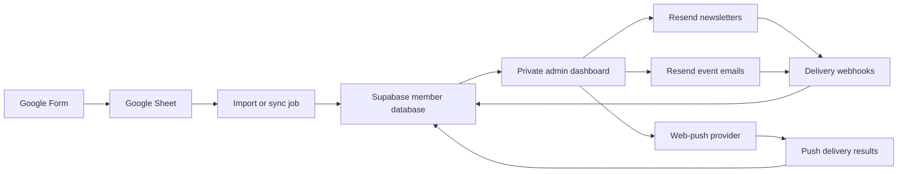

# Physical I/O Member Admin & Communications Plan

## Goal

Build a private admin application for managing Physical I/O members collected through the existing Google Form, creating newsletters, sending event email updates, and eventually delivering browser push notifications.

The proposed stack is:

- **Next.js** for the public site and private admin interface
- **Better Auth** for internal administrator authentication, sessions, invitations, and roles
- **Supabase Postgres** for member data, campaign records, outreach CRM data, permissions, and audit logs
- **Resend** for newsletters, event emails, contact preferences, and delivery webhooks
- **Google Sheets** as the initial signup intake source
- **OneSignal or another managed web-push provider** for browser push notifications

## Current State

- The project uses Next.js 15, React 19, and TypeScript.
- It is currently configured as a static export using `output: "export"`.
- The Google Sheet is titled **Physical I/O Signup Questionnaire (Responses)**.
- It has one response tab, **Form Responses 1**, with approximately 187 signup rows.
- The populated form fields are:
  - Timestamp
  - Full name
  - Email address
  - City
  - Professional role
  - Industry experience
  - Physical AI / Spatial Intelligence work areas
  - Company, portfolio, or GitHub link
  - LinkedIn link
  - Community goals
  - Preferred event formats
  - Community suggestions
- The form does not currently appear to capture explicit newsletter consent or browser-push consent.

## Recommended Architecture

Supabase should become the operational source of truth after import. Google Sheets should remain the raw signup source rather than being queried whenever an administrator opens the dashboard.

## Admin Application

### Dashboard

Show a concise overview of:

- Total active members
- New signups this week and month
- Members by city and professional role
- Newsletter subscribers
- Push subscribers
- Recent campaigns
- Email delivery, bounce, complaint, and unsubscribe rates
- Upcoming events
- Google Sheet sync status
- Invalid or rejected import rows

### Member Management

Create a searchable, filterable member table containing:

- Name and email
- City
- Role and experience
- Areas of interest
- Preferred event formats
- Membership status
- Email and push subscription status
- Signup date and source
- Tags
- Last contacted date
- Engagement summary

Member actions should include:

- View and edit a profile
- Add internal notes and tags
- Filter members and save reusable segments
- Import new Google Sheet responses
- Export a filtered CSV
- Archive or suppress a contact
- Review consent history
- Send an individual test or event message

Useful initial segments include:

- London members
- Founders and operators
- Designers
- Engineers and developers
- Robotics members
- AI/ML members
- Members interested in workshops
- Members interested in demo nights
- New members who have not received a welcome message

### Campaign Composer

Use one campaign workflow for:

- Newsletters
- Event updates
- Announcements
- Push notifications

Email composer features:

- Campaign name
- Subject and preview text
- Sender name and reply-to address
- Branded content blocks
- Image, button, divider, and event-card blocks
- First-name personalisation
- Audience selection and recipient count
- Desktop and mobile preview
- Send a test email
- Save as draft
- Schedule or send now
- Duplicate a previous campaign
- Final confirmation showing the exact audience and channel
- Delivery and engagement report

Resend Contacts, Properties, Segments, Topics, and Broadcasts should be used where practical so that unsubscribe handling and email preferences are not reimplemented unnecessarily.

### Event Management

Each event should support:

- Title
- Date and time
- Venue
- Description
- Registration URL
- Draft, published, or completed status
- Target audience segments
- Initial announcement
- Reminder sequence
- Last-minute venue or schedule update
- Post-event follow-up
- Campaign history

The first version can link to an external registration service. Native RSVP and attendance management can be added later.

### Browser Push Notifications

Browser push requires separate opt-in and is not provided directly by Supabase or Resend.

Recommended approach:

- Use OneSignal or another managed provider for the first release.
- Add a website permission and preference flow.
- Store the provider subscription ID and consent timestamp in Supabase.
- Send push messages from the same campaign composer.
- Support a title, short body, target URL, icon, test notification, and audience segment.
- Automatically remove expired or invalid subscriptions.

Push should be implemented after the email workflow is stable. Existing members cannot receive browser push until they revisit the website and explicitly opt in.

## Supabase Data Model

### `members`

- `id`
- `email`
- `email_normalized`
- `full_name`
- `first_name`
- `city`
- `professional_role`
- `experience_range`
- `website_url`
- `linkedin_url`
- `status`
- `source`
- `source_row`
- `signed_up_at`
- `created_at`
- `updated_at`

### `member_interests`

Normalized work areas, community goals, and preferred formats. Multi-select form answers should not remain as one unsearchable comma-separated value.

### `tags` and `member_tags`

Administrator-managed labels for segmentation and internal organization.

### `subscriptions`

- Member
- Channel
- Topic
- Status
- Consent timestamp
- Consent source
- Consent wording/version
- Unsubscribe timestamp

### `segments` and `segment_rules`

Saved dynamic filters used by campaigns.

### `campaigns`

- Campaign type
- Status
- Subject and preview text
- Content or template payload
- Target segment
- Scheduled time
- Sent time
- Created-by administrator
- Resend or push-provider identifiers

### `campaign_recipients`

Store the resolved audience and per-recipient delivery state. This makes campaign reporting reproducible even if a segment later changes.

### `campaign_events`

Webhook events such as delivered, bounced, complained, opened, clicked, and unsubscribed.

### Additional Tables

- `events`
- `email_templates`
- `push_subscriptions`
- `imports`
- `import_rows`
- `admin_profiles`
- `audit_log`

## Google Sheet Import Strategy

### Initial Import

1. Read all existing form responses.
2. Normalize email addresses to lowercase and trim whitespace.
3. Deduplicate by normalized email.
4. Preserve the earliest signup timestamp.
5. Merge later responses without losing original raw values.
6. Validate email addresses and URLs.
7. Record rejected rows for administrator review.
8. Preserve the source spreadsheet row for traceability.
9. Sync a member to Resend only when their subscription state permits it.

### Ongoing Sync

Start with an administrator-controlled **Sync signups** action. Once the import behavior has been validated, automate ingestion using a scheduled job or Google Apps Script webhook.

Admin edits should not write back into the Google Form response sheet. A two-way sync would create competing sources of truth.

## Authentication and Security

- Move the project away from static-only export so server authentication, protected routes, API endpoints, and webhooks can run.
- Deploying the Next.js application on Vercel is the simplest path.
- Use Better Auth for assigned internal administrators.
- Store Better Auth users, accounts, sessions, and role fields in the Supabase-hosted PostgreSQL database in a dedicated `better_auth` schema. Do not use Supabase's managed `auth` schema.
- Mount the Better Auth Next.js handler at `/api/auth/[...all]`.
- Protect `/admin`, server actions, API routes, Workflow controls, and webhook-management operations on the server by retrieving and validating the Better Auth session.
- Disable public administrator signup. Access should be invitation-only or restricted to a verified allowlist.
- Use the Better Auth Admin plugin with custom permissions for outreach roles.
- Keep lead assignment and domain-specific authorization in protected CRM tables; an auth role alone must not grant access to every lead.
- Never use client-editable profile fields for authorization.
- Use database-backed sessions so administrators can review and revoke active sessions.
- For sensitive operations, bypass any session cookie cache and revalidate the session and permissions against the database.
- Never expose the Supabase service-role key or Resend API key to browser code.
- Do not expose protected CRM tables through the browser-facing Supabase Data API.
- Enable RLS as defense in depth on any table that remains in an exposed schema, and deny `anon` and `authenticated` Data API access unless a separate public use case explicitly requires it.
- Access protected member and outreach data through authenticated Next.js server routes/actions using a server-only database connection.
- Limit member data access using Better Auth permissions plus explicit lead/team assignments.
- Record sensitive admin actions in `audit_log`.
- Rate-limit send and import endpoints.
- Use idempotency protection to prevent duplicate campaign sends.

### Better Auth Configuration

Recommended configuration:

- `BETTER_AUTH_URL` set to the deployed first-party application URL
- A high-entropy `BETTER_AUTH_SECRET`, with a documented rotation procedure using versioned secrets
- Same-origin signed, HTTP-only, secure cookies
- Better Auth Drizzle adapter connected to Supabase Postgres
- Better Auth schema generated and reviewed before migration
- Admin server and client plugins configured with the same custom permission definitions
- Short session lifetime appropriate for internal administration
- Immediate session revocation during administrator offboarding
- Optional Google OAuth for staff sign-in, restricted to invited email addresses
- Two-factor authentication required before enabling contract, finance, or user-management privileges

Suggested Better Auth permission resources:

- `member`: `read`, `update`, `export`
- `lead`: `read`, `create`, `update`, `assign`, `close`
- `message`: `draft`, `approve`, `send`
- `template`: `read`, `create`, `update`, `publish`
- `meeting`: `create`, `update`, `cancel`
- `resource`: `read`, `upload`, `share`
- `agreement`: `read`, `prepare`, `send`, `void`
- `delivery`: `read`, `update`, `complete`
- `workflow`: `read`, `start`, `resume`, `retry`, `cancel`
- `admin_user`: `invite`, `set_role`, `revoke_session`, `disable`

## Consent and Privacy

Before sending marketing communications broadly:

- Add explicit email-update consent to the Google Form.
- Add a privacy-notice link.
- Capture the consent timestamp and wording/version.
- Consider separate topics for newsletters, events, and community announcements.
- Require a separate browser permission flow for push notifications.
- Include unsubscribe and preference-management links in emails.
- Immediately suppress bounced, complained, and unsubscribed addresses.
- Support member data export and deletion requests.
- Define retention periods for rejected imports and campaign logs.

Existing members without explicit marketing consent should initially be marked `consent_unknown`. They should not be silently enrolled in every marketing channel. A carefully reviewed membership-related message can invite them to select communication preferences.

## Resend Integration

- Verify a Physical I/O sending domain.
- Configure SPF and DKIM records.
- Use a consistent sender and monitored reply-to address.
- Create branded React Email templates.
- Synchronize permitted members to Resend Contacts.
- Map relevant member data to contact properties.
- Use Topics for user-facing email preferences.
- Use Segments and Broadcasts for newsletters where appropriate.
- Include Resend's managed unsubscribe URL.
- Receive webhook events for delivery, bounce, complaint, and unsubscribe changes.
- Verify webhook signatures before accepting events.
- Update Supabase subscription and campaign state from each verified event.

## Delivery Phases

### Phase 1 — Foundation

- Remove the static-export-only constraint.
- Configure a server-capable deployment.
- Create the Supabase project and migrations.
- Add Better Auth, its PostgreSQL schema, invitation-only administrator access, and server-side route protection.
- Implement RLS and administrator roles.
- Import and deduplicate existing Google Sheet responses.
- Build the members table and member detail page.

### Phase 2 — Email Operations

- Configure and verify the sending domain in Resend.
- Add branded React Email templates.
- Synchronize permitted contacts to Resend.
- Build the newsletter and event-email composer.
- Add audience filters, previews, drafts, and test sends.
- Add send-confirmation safeguards.
- Process Resend webhooks.
- Build campaign reporting.

### Phase 3 — Events and Automation

- Build event records and campaign workflows.
- Add scheduled announcements and reminders.
- Automate Google Form response ingestion.
- Add a welcome or preference-confirmation workflow.
- Add import error reporting and retry controls.

### Phase 4 — Push Notifications

- Select and configure a managed push provider.
- Add public push opt-in UI and a service worker.
- Store subscriptions and consent evidence.
- Add push composition, segmentation, testing, and reports.
- Clean up expired subscriptions.

### Phase 5 — Hardening

- Complete the audit log.
- Add rate limiting and idempotent sending.
- Prevent duplicate scheduled jobs and campaign sends.
- Perform accessibility and responsive QA.
- Add backup and export workflows.
- Add end-to-end tests for authorization, imports, consent, unsubscribes, and scheduling.

## Recommended MVP

The first production release should include:

- Secure invitation-only Better Auth administrator login
- Member import and management
- Search, filters, tags, and saved segments
- Newsletter and event-email composer
- Test, send, and schedule workflows
- Resend unsubscribe and delivery tracking
- Events list with announcement and reminder actions
- Consent and suppression management

Browser push should follow as a separate release after email delivery and consent handling are proven.

## Decisions Needed Before Implementation

- Confirm Vercel as the server-capable deployment target.
- Confirm Google OAuth as the preferred Better Auth sign-in method, with email/password or magic link retained only if operationally required.
- Confirm the Physical I/O sending domain and sender address.
- Decide whether Resend Broadcasts or a fully custom campaign renderer should be the primary newsletter engine.
- Choose a managed browser-push provider.
- Review and approve the consent wording and privacy notice.
- Decide whether the Google Form remains the long-term signup interface or is later replaced by a native website form.
