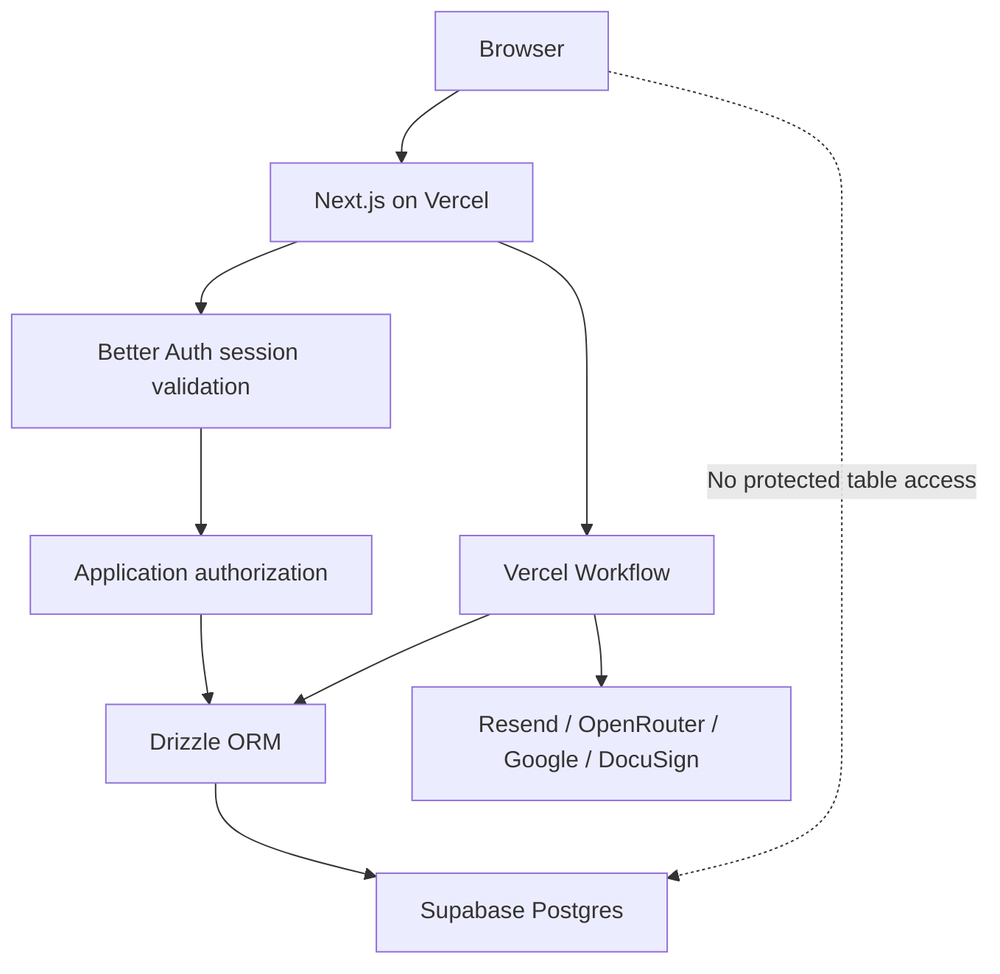

# Selected Database & Authentication Architecture

## Architecture Decision

Use **Better Auth with Supabase-hosted PostgreSQL and server-only application data access**.

This is the selected approach for the first production release:

- Better Auth owns identity, email verification, OAuth accounts, credentials, sessions, two-factor state, authentication roles, and authentication permissions.
- Supabase hosts PostgreSQL, Storage, backups, observability, and local/preview database tooling.
- Drizzle ORM provides typed application queries and the Better Auth database adapter.
- Supabase SQL migrations are the only production database migration history.
- Next.js server components, server actions, and route handlers validate Better Auth sessions and perform all protected queries.
- Vercel Workflow steps use server-only database connections for durable automation.
- Protected member, admin, outreach, agreement, and sponsorship tables are not exposed to browser-side Supabase Data API clients.
- Application authorization combines Better Auth permissions, resource ownership, membership state, and explicit lead/team assignment.



## How Better Auth and Supabase Work Together

Better Auth uses the Supabase PostgreSQL database as its persistence layer. Supabase Auth is not used.

Better Auth is authoritative for:

- User ID
- Primary email
- Email verification
- Password credentials
- OAuth identities and tokens
- Sessions
- Authentication roles and permissions
- Two-factor authentication state

Application tables are authoritative for:

- Membership status
- Member profile and onboarding answers
- Interests, skills, goals, and participation preferences
- Consent and communication preferences
- Event registration and resources
- Admin assignments
- Leads, contacts, messages, and tasks
- Proposals, agreements, sponsorships, and delivery
- Workflow and audit records

The canonical relationship is:

```text
better_auth.user.id
        │
        ├── app.member_profiles.auth_user_id
        ├── outreach.lead_assignments.admin_user_id
        ├── outreach.messages.created_by_user_id
        └── audit.events.actor_user_id
```

Do not store passwords or OAuth credentials in application tables. Do not allow members to directly edit a duplicate copy of their Better Auth primary email.

## Selected Authorization Option — Server-Only Access

Better Auth sessions do not automatically populate Supabase Auth's `auth.uid()`. Standard Supabase ownership policies based on `auth.uid()` therefore do not identify Better Auth users.

For the selected approach:

1. The browser sends the Better Auth session cookie to Next.js.
2. The server validates the session.
3. The server derives the user ID from the validated session.
4. The server checks authentication permissions and application-level ownership or assignment.
5. The server runs a narrowly scoped database query.
6. Sensitive reads and mutations are recorded in the audit log.

Rules:

- Never accept an authoritative user ID, admin ID, owner ID, or role from browser input.
- Every ownership predicate must use the user ID derived from the server session.
- A valid login does not imply active membership.
- A member role does not grant administrator access.
- An administrator role does not automatically grant access to every outreach lead.
- Sensitive actions must revalidate the database-backed session and current permissions.
- Protected schemas must not be granted to Supabase `anon` or `authenticated` Data API roles.
- RLS should be deny-by-default on protected tables if they are ever placed in an exposed schema.

## Alternative Options Considered

### Option A — Server-Only Access

**Status: selected.**

Advantages:

- One authentication system
- Clear authorization boundary
- No custom JWT bridge
- Compatible with member, admin, outreach, Workflow, and webhook operations
- Protected database is not directly reachable from browser clients
- Easier auditing and permission enforcement

Tradeoffs:

- All protected data passes through Next.js
- Server queries must consistently apply ownership and assignment checks
- Database-level RLS does not automatically know the Better Auth user

### Option B — Custom PostgreSQL RLS Identity Propagation

The server would open a transaction, set a trusted transaction-scoped Better Auth user identifier, and use custom RLS policies that read that identifier.

**Status: deferred.**

Potential benefits:

- Additional database-level ownership enforcement
- Defense against an accidentally broad application query

Reasons to defer:

- More complex transaction management
- Additional testing with serverless transaction pooling
- Easy to implement incorrectly if identity context leaks between pooled connections
- Still requires server-side session validation

Reconsider this option for highly sensitive finance, agreement, or cross-team data after the core system is stable.

### Option C — Supabase-Compatible JWT Bridge

Better Auth would issue or exchange tokens that the Supabase Data API could interpret for RLS.

**Status: not recommended for the MVP.**

Reasons:

- Introduces a second token and authorization model
- Adds claim synchronization and expiry complexity
- Increases the chance of stale or unsafe permissions
- Makes session revocation and debugging harder
- Provides little benefit when the application already requires server workflows and privileged integrations

## PostgreSQL Schema Layout

Use schemas to separate ownership and exposure:

```text
better_auth   Better Auth users, accounts, sessions, verification, plugins
app           Members, onboarding, preferences, events, resources
outreach      Organisations, contacts, leads, messages, agreements, delivery
automation    Workflow runs, provider events, idempotency and retries
audit         Immutable or append-only security and activity records
public        Only deliberately public or Data-API-exposed objects
storage       Supabase-managed Storage metadata
```

Do not put Better Auth tables in Supabase's managed `auth` schema.

## Database Tooling

### Runtime ORM

Use Drizzle ORM for:

- Typed PostgreSQL schemas
- Type-safe queries
- Better Auth's official Drizzle adapter
- Relationships between Better Auth users and application records
- Reusable query functions with enforced authorization predicates

Recommended code structure:

```text
lib/
  auth/
    auth.ts
    auth-client.ts
    permissions.ts
    require-session.ts
  db/
    client.ts
    schemas/
      better-auth.ts
      members.ts
      outreach.ts
      campaigns.ts
      automation.ts
      audit.ts
    queries/
      members.ts
      outreach.ts
      permissions.ts
      workflows.ts
```

Centralize protected queries. UI components and route handlers should not build ad hoc authorization-sensitive queries throughout the codebase.

### Canonical Migration System

Use Supabase CLI SQL migrations as the only deployment history:

```text
supabase/
  config.toml
  migrations/
    <timestamp>_create_better_auth_schema.sql
    <timestamp>_create_member_profiles.sql
    <timestamp>_create_onboarding.sql
    <timestamp>_create_outreach_crm.sql
    <timestamp>_create_permissions.sql
  seed.sql
```

Rules:

- Create migrations with `supabase migration new <description>`.
- Apply and test them locally with `supabase db reset`.
- Commit every migration to Git.
- Apply migrations to preview before production.
- Deploy with `supabase db push` through a controlled CI process.
- Never change the production schema manually through the Table Editor or SQL Editor after migration tracking begins.
- Never run Better Auth migrations automatically during application startup.
- Do not maintain a separate production migration history with Better Auth CLI or Drizzle Kit.

### Better Auth Schema Updates

When Better Auth or a plugin changes its schema:

1. Update the pinned Better Auth packages.
2. Run Better Auth schema generation for the Drizzle adapter.
3. Review the generated schema and relationship changes.
4. Create a new Supabase migration.
5. Translate or generate the required SQL into that migration.
6. Test a clean local reset and authentication flows.
7. Run security and migration verification.
8. Apply through the same preview and production pipeline.

Better Auth generation informs the schema, while Supabase migrations remain the deployment ledger.

## Database Connections

Use separate connection strings for runtime and migration operations.

### Runtime

Use Supabase's transaction-mode pooler for Next.js server functions and Vercel Workflow steps:

```env
DATABASE_URL=postgres://...pooler...:6543/postgres
```

Use a small application-side connection pool because Vercel may create many concurrent function instances.

### Migrations and Administration

Use the direct PostgreSQL connection for migrations, schema inspection, backups, and database tooling:

```env
DIRECT_DATABASE_URL=postgres://...db.project.supabase.co:5432/postgres
```

Do not run schema migrations through the transaction-mode pooler.

## Database Roles

Create restricted PostgreSQL roles rather than running normal application traffic as the all-powerful `postgres` user:

```text
physical_io_auth      Better Auth schema operations at runtime
physical_io_app       Member, admin, and outreach application queries
physical_io_worker    Workflow, webhook, and integration processing
physical_io_readonly  Reporting and operational diagnosis
physical_io_migrate   Schema migrations through CI only
```

Principles:

- Runtime roles cannot create or drop schemas.
- Migration credentials are not available to the browser or normal application routes.
- The worker role cannot manage Better Auth users unless a specific workflow requires it.
- The readonly role cannot mutate member, consent, outreach, or agreement data.
- Supabase `anon` and `authenticated` roles receive no access to protected schemas.
- Secrets are separate by environment and rotated when access changes.

## Referential Integrity and Deletion

Use database foreign keys for stable relationships, including Better Auth user references.

Deletion behavior must be deliberate:

- Deleting an authentication user must not automatically erase signed agreements, invoices, or legally required audit records.
- Member profile deletion should run through the account deletion workflow.
- Eligible personal data should be deleted or anonymized.
- Required commercial records should be retained with restricted access and minimal personal data.
- Provider event IDs, idempotency keys, normalized emails where appropriate, and workflow run IDs should have unique constraints.
- Historical sent messages and template versions should remain immutable, subject to the retention policy.

## Database Index Baseline

Plan indexes for:

```text
better_auth.session(token)
better_auth.session(user_id, expires_at)
better_auth.user(lower(email))

app.member_profiles(auth_user_id)
app.member_profiles(membership_status)
app.member_consents(member_id, purpose)
app.event_registrations(member_id, event_id)

outreach.contacts(lower(email))
outreach.leads(status, owner_id)
outreach.lead_assignments(lead_id, admin_user_id)
outreach.messages(provider_message_id)
outreach.messages(internet_message_id)
outreach.tasks(assignee_id, due_at, status)

automation.workflow_runs(run_id)
automation.external_events(provider, provider_event_id)
automation.idempotency_keys(key)
```

Confirm index names and exact column types when producing the schema migrations.

## Environments, Backups, and Deployment Safety

Maintain separate databases for:

- Local development
- Preview or staging
- Production

Rules:

- Never copy live member or lead data into preview deployments.
- Seed local and preview environments with synthetic data.
- Run every migration against a clean local database.
- Test destructive or high-volume migrations against a sanitized production-like snapshot.
- Prefer additive migrations before destructive ones.
- Backfill data separately from initial column creation when the table is large.
- Deploy code compatible with both old and new schemas before removing old columns.
- Remove deprecated columns in a later migration.
- Verify grants, exposed schemas, RLS state, indexes, and constraints after migration.
- Monitor connection usage, slow queries, storage growth, and failed workflows.

Supabase Branching may be used for preview database environments once the migration workflow is established.

## Required Database Tests

Before release, verify:

- A member can read and update only their profile.
- A member cannot access `/admin` or outreach records.
- An outreach contributor can access only assigned leads.
- An approver can approve but cannot gain unrelated finance permissions.
- A finance/legal user cannot send outreach without the message permission.
- Revoked Better Auth sessions stop working.
- Suspended members cannot access active-member resources.
- Public Supabase Data API roles cannot read protected schemas.
- Duplicate webhook events do not create duplicate messages or status changes.
- Duplicate Workflow starts do not send duplicate emails.
- Account deletion preserves only records required by the retention policy.
- Database reset recreates the complete schema from committed migrations.

## Implementation Decision Summary

| Area | Selected approach |
| --- | --- |
| Authentication | Better Auth |
| Database hosting | Supabase Postgres |
| Supabase Auth | Not used |
| ORM | Drizzle ORM |
| Better Auth adapter | Official Drizzle adapter |
| Protected data access | Next.js server only |
| Browser Data API | No access to protected schemas |
| Authorization | Better Auth permissions plus ownership/assignment checks |
| Production migrations | Supabase CLI SQL migrations |
| Runtime connection | Supabase transaction-mode pooler |
| Migration connection | Direct PostgreSQL connection |
| Automation | Vercel Workflow |
| Database identity RLS | Deferred custom option, not `auth.uid()` |

This architecture is the default unless a later security review identifies a clear need for custom Better Auth-aware RLS identity propagation.
