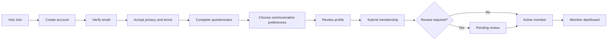

# First-Party Member Signup, Onboarding & Dashboard

## Outcome

Replace the Google Form with a first-party questionnaire and onboarding experience inside the Physical I/O website. New members will create a verified account, complete their profile and preferences, and write directly to Supabase Postgres through authenticated Next.js server actions.

Members will then have a private dashboard for maintaining their profile, communication preferences, events, resources, and community activity. The existing Google Sheet becomes a migration source and temporary fallback, not the long-term signup system.

## Identity Model

Use one Better Auth deployment for both members and internal administrators, with different roles, permissions, entry points, and onboarding rules.

### Member Access

- Public registration is available through `/join`.
- Email ownership must be verified before a membership becomes active.
- Google OAuth may be offered as a convenient sign-in method.
- New accounts receive only the `member` role.
- A member can access only their own profile, preferences, registrations, files, and messages intended for them.
- Registering as a member must never grant access to `/admin` or outreach data.

### Administrator Access

- Administrator access remains invitation-only.
- Admin roles are assigned by an existing authorized administrator.
- Admin permissions remain separate from member status.
- A person may be both a member and an administrator, but elevated permissions must be explicit and auditable.
- Sensitive admin actions should force a fresh database-backed session check and, where configured, two-factor authentication.

## Member Journey

Recommended membership states:

- `account_created`
- `email_verification_pending`
- `onboarding_in_progress`
- `profile_incomplete`
- `pending_review`
- `active`
- `paused`
- `suspended`
- `archived`

Authentication state and membership state must remain separate. A valid session does not imply an active membership.

## Signup and Questionnaire Front End

### Route Structure

- `/join` — introduction, expectations, and account creation
- `/verify-email` — verification instructions and resend action
- `/onboarding` — resumable multi-step questionnaire
- `/onboarding/review` — final review and consent confirmation
- `/member` — private member dashboard
- `/member/profile` — profile editing
- `/member/preferences` — email, push, privacy, and visibility preferences
- `/member/events` — event registrations and updates
- `/member/resources` — member resources and saved links
- `/member/security` — sessions, sign-in methods, and account controls

### Questionnaire Steps

#### 1. Basic Profile

- Full name
- Preferred name
- City and country
- Timezone
- Profile image, optional
- Short introduction, optional

#### 2. Professional Background

- Primary role
- Years of experience
- Organisation
- Job title
- Company, portfolio, or GitHub URL
- LinkedIn URL
- Student or professional status where relevant

#### 3. Physical AI Interests

- Physical AI
- Robotics
- Spatial intelligence
- Embodied AI
- Wearables
- Intelligent hardware
- Human-computer interaction
- Computer vision
- Industrial design
- Design engineering
- Other interests

#### 4. Current Work

- What the member is building, researching, or learning
- Project stage
- Skills they can offer
- Skills or collaborators they are looking for
- Whether they are open to mentoring, speaking, hiring, or collaboration

#### 5. Community Goals

- Learning from talks and demos
- Meeting collaborators or co-founders
- Hiring or finding work
- Showcasing a project
- Staying current with the field
- Finding investment or commercial partners
- Other goals

#### 6. Participation Preferences

- In-person meetups
- Demo nights
- Talks and panels
- Hands-on workshops
- Socials and networking
- Online community
- Speaking or presenting interest
- Volunteering interest

#### 7. Communication and Privacy

- Essential membership email acknowledgement
- Optional newsletter consent
- Optional event-update consent
- Optional partner or opportunity communications
- Optional browser-push interest; actual browser permission is requested later in context
- Member-directory visibility
- Which profile fields may be visible to other members
- Privacy notice and terms acceptance with version and timestamp

Consent choices must not be preselected. Essential service messages and optional marketing topics must be clearly distinguished.

### Form Behavior

- Save progress after every step.
- Allow members to leave and resume on another device.
- Validate on the client for usability and again on the server for trust.
- Use stable option identifiers rather than storing display labels as database values.
- Preserve the questionnaire/version used for each submission.
- Show progress, estimated completion time, and clear back/continue controls.
- Make every step keyboard-accessible and mobile-friendly.
- Prevent duplicate submission with idempotency keys.
- Never expose direct database credentials or privileged Supabase keys.
- Write through authenticated server actions or route handlers.
- Provide a final review screen before activation.
- Store partial drafts separately from the accepted member profile.

## Member Dashboard

### Dashboard Home

Show:

- Welcome and membership status
- Profile-completion indicator
- Upcoming Physical I/O events
- Recent announcements
- Recommended resources
- Pending actions
- Communication preference summary
- Quick links to edit profile or register for an event

### Profile

Members should be able to:

- Update personal and professional information
- Maintain interests, skills, and collaboration goals
- Change links and biography
- Upload or replace a profile image
- Preview what other members can see
- See when their profile was last updated

Sensitive changes such as primary email should use Better Auth's verified email-change flow rather than directly updating the CRM row.

### Preferences

Members should be able to:

- Subscribe or unsubscribe from each email topic
- Manage push-notification subscriptions
- Choose member-directory visibility
- Control field-level profile visibility
- Pause nonessential communications
- Review consent history
- Download their data
- Request account and profile deletion

Preference changes should update Supabase immediately and then synchronize to Resend through an idempotent Vercel Workflow.

### Events

The member event area should support:

- Upcoming and past events
- Registration status
- Registration and cancellation
- Calendar file or Google Calendar link
- Google Meet or venue details when permitted
- Reminder preferences
- Post-event resources
- Feedback forms

Native event registration can be introduced after the member account foundation. Until then, event cards may link to an approved external registration page while still recording click or interest state where consent permits.

### Resources

Provide access to:

- Event recordings and slides
- Community guides
- Sponsorship or partner resources intended for members
- Shared project links
- Saved resources

Every resource needs a visibility level such as public, active members, selected segment, event attendees, or administrators only.

### Security and Account

Members should be able to:

- View active sessions
- Revoke other sessions
- Review sign-in methods
- Add or remove supported providers safely
- Change password when password authentication is enabled
- Enable two-factor authentication when offered
- Request data export
- Request account deletion

## Member Data Model Extensions

### `member_profiles`

- `id`
- `auth_user_id` referencing the Better Auth user
- `legacy_member_id`, nullable
- `membership_status`
- `preferred_name`
- `city`
- `country_code`
- `timezone`
- `bio`
- `organisation`
- `job_title`
- `professional_role`
- `experience_range`
- `website_url`
- `linkedin_url`
- `profile_image_path`
- `directory_visibility`
- `onboarding_completed_at`
- `last_profile_reviewed_at`
- `created_at`
- `updated_at`

Do not duplicate Better Auth's authoritative email address or sign-in credentials in editable profile fields. A normalized email may be retained in a controlled reconciliation table or synchronized read model when operationally necessary.

### Onboarding Tables

- `onboarding_submissions`
- `onboarding_answers`
- `onboarding_versions`
- `onboarding_progress`
- `membership_status_history`

Keep draft answers separate until final submission. On completion, validate the whole questionnaire transactionally and update the canonical member profile and related interest records.

### Profile Taxonomy Tables

- `interest_options`
- `member_interests`
- `skill_options`
- `member_skills`
- `goal_options`
- `member_goals`
- `participation_options`
- `member_participation_preferences`

This allows administrators to rename display labels without corrupting historical data or filters.

### Privacy and Consent Tables

- `consent_definitions`
- `member_consents`
- `profile_visibility_rules`
- `data_requests`

Each consent record should include the member, purpose, status, source, notice version, capture timestamp, withdrawal timestamp, and relevant evidence.

### Member Activity Tables

- `event_registrations`
- `member_saved_resources`
- `member_notifications`
- `member_notification_reads`
- `member_activity_events`

Activity data should be minimal, purpose-limited, and governed by a retention policy.

## Existing Google Form Migration

The current Google Sheet should be imported before the first-party onboarding launch.

### Claiming an Existing Profile

1. Existing member creates a Better Auth account using the same email address recorded in the Sheet.
2. The email address is verified.
3. The server searches the controlled legacy-member reconciliation table by normalized verified email.
4. If exactly one safe match exists, the member is invited to review and claim that profile.
5. The member confirms and updates the imported answers.
6. The system links the Better Auth user to the existing member profile.
7. The claim and source rows are recorded in the audit trail.

Do not auto-link on an unverified email, and do not expose whether an arbitrary email already exists in the member database. Ambiguous or conflicting matches should create a private administrator review task.

### Migration Cutover

1. Import and validate all Sheet responses.
2. Launch account claiming for existing members.
3. Release the first-party `/join` flow for new members.
4. Keep the Google Form read-only or clearly marked as retired.
5. Monitor both sources during a short, defined cutover window.
6. Remove the Google Form from public navigation.
7. Retain the original export according to the data-retention policy.

After cutover, no new application should depend on Google Sheets as an operational database.

## Member Authorization Boundary

Because Better Auth manages identities outside Supabase Auth, member sessions do not automatically populate Supabase's `auth.uid()`.

Therefore:

- Member dashboard data should be loaded through authenticated Next.js server components, server actions, or route handlers.
- Every server operation must derive the Better Auth user id from the server-side session.
- Ownership checks must use that derived id, never a user id submitted by the browser.
- Protected member tables should not be available through the browser-facing Supabase Data API.
- RLS should deny public Data API access to protected tables as defense in depth.
- Server queries should select and mutate only rows owned by the authenticated member unless an explicit administrator permission applies.
- Admin routes must separately validate Better Auth admin permissions; being a member is insufficient.

## Member Onboarding Workflows

### Registration Workflow

- Better Auth creates the account.
- Verification email is sent.
- After verification, create or locate the onboarding draft idempotently.
- Check privately for a claimable legacy profile.
- Record onboarding start and version.

### Onboarding Completion Workflow

- Revalidate every answer on the server.
- Store consent evidence.
- Create or update normalized profile relations.
- Link a verified legacy record when explicitly claimed.
- Set membership state to `active` or `pending_review`.
- Synchronize allowed topics to Resend.
- Send a welcome email.
- Create an internal review task only when rules require it.

### Preference Sync Workflow

- Start when a member changes communication preferences.
- Persist the local preference first.
- Synchronize it to Resend Topics.
- Retry transient provider failures.
- Show sync state without reverting the member's local withdrawal choice.
- Suppress optional messages immediately when consent is withdrawn, even if provider synchronization is delayed.

### Account Deletion Workflow

- Reauthenticate the member.
- Show the consequences and any retention obligations.
- Revoke active sessions.
- Stop optional communications and push subscriptions.
- Remove or anonymize eligible profile and activity data.
- Retain only legally required operational records with restricted access.
- Record completion without retaining unnecessary deleted content.

## Abuse Prevention

- Rate-limit signup, email verification, password reset, and profile-claim endpoints.
- Add bot protection to public registration and onboarding submission.
- Prevent account enumeration through error messages.
- Validate and normalize URLs and free-text fields.
- Scan uploaded images and enforce file size/type limits.
- Moderate public-facing biography and directory fields before wider directory features launch.
- Block disposable or obviously invalid addresses when appropriate without excluding legitimate users arbitrarily.
- Add administrator suspension controls and a member appeal/contact path.

## Delivery Phases

### Member Phase 1 — Identity and Migration

- Configure Better Auth member registration and email verification.
- Keep administrator enrollment invitation-only.
- Add member/admin permission separation.
- Import Google Sheet profiles into normalized member tables.
- Build safe verified-email profile claiming.

### Member Phase 2 — First-Party Onboarding

- Build `/join` and the resumable questionnaire.
- Add server-side validation and draft persistence.
- Add consent and privacy controls.
- Add final review and membership activation.
- Replace the public Google Form link.

### Member Phase 3 — Dashboard Foundation

- Build member dashboard home.
- Add profile and preference management.
- Add session and account controls.
- Add data export and deletion request flows.
- Add Resend preference synchronization.

### Member Phase 4 — Events and Resources

- Add event discovery and registration.
- Add reminders and calendar links.
- Add member-scoped resources and saved items.
- Add post-event materials and feedback.

### Member Phase 5 — Community Features

- Add an opt-in member directory.
- Add collaboration and speaking indicators.
- Add member-to-member connection requests with privacy controls.
- Add recommendations only after sufficient consent, moderation, and safety controls exist.

## Recommended Member MVP

- Better Auth account registration and verified email
- Existing-member profile claim by verified email
- Resumable multi-step questionnaire
- Direct server-side database persistence
- Explicit consent and privacy choices
- Member dashboard home
- Profile editing
- Communication-preference management
- Account/session controls
- Upcoming events and member resources
- Strict separation between member and admin permissions

The member directory, recommendations, messaging between members, and advanced community matching should be later releases rather than part of the initial onboarding launch.
