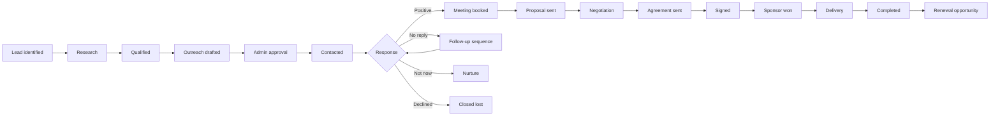

# Sponsor Outreach CRM & End-to-End Automation

## Outcome

Extend the private admin application into the central system for sponsor outreach. Assigned administrators should be able to manage the complete relationship—from a newly identified lead through personalised outreach, replies, meetings, proposals, paperwork, sponsorship delivery, and renewal—without coordinating the workflow across disconnected tools.

The dashboard and Supabase should remain the system of record. Internal durable workflows hosted on Vercel may execute automation, but they should never hold the only copy of a lead, activity, status, or decision.

## Sponsor Lifecycle

Recommended statuses:

- `new`
- `researching`
- `qualified`
- `ready_for_outreach`
- `draft_pending_approval`
- `contacted`
- `follow_up_due`
- `replied_positive`
- `replied_neutral`
- `replied_negative`
- `meeting_scheduled`
- `proposal_in_progress`
- `proposal_sent`
- `negotiation`
- `agreement_sent`
- `signed`
- `sponsor_won`
- `delivery_in_progress`
- `delivery_complete`
- `nurture`
- `closed_lost`
- `renewal_due`

Every status change should record the previous value, new value, administrator, timestamp, and optional reason. Automations may recommend or apply low-risk changes, but administrators must be able to correct them.

## Outreach Dashboard

### Pipeline View

Provide both Kanban and table views with:

- Lead or organisation
- Primary contact
- Owner
- Sponsorship fit score
- Current status
- Estimated sponsorship value
- Last activity
- Next action and due date
- Reply state
- Meeting state
- Proposal and agreement state
- Delivery health

Allow administrators to filter by owner, status, industry, location, value, event, next-action date, engagement, and data source.

### Lead Workspace

Each lead should have one workspace containing:

- Organisation profile and website
- Contact details and role
- Relationship owner and assigned collaborators
- Research notes and source links
- AI-generated summary and sponsorship-fit rationale
- Email and meeting timeline
- Tasks and next actions
- Drafts and approved messages
- Shared resources
- Meetings and notes
- Proposals and sponsorship packages
- DocuSign envelopes
- Commercial value and expected close date
- Sponsorship deliverables
- Full audit history

### Unified Conversation Timeline

The timeline should show:

- Outbound emails
- Inbound replies
- Drafts and approvals
- Delivery, bounce, open, and click events
- Internal notes
- Status changes
- Tasks and reminders
- Google Meet bookings
- Shared resources
- Proposal changes
- DocuSign events
- Sponsor-delivery milestones

Replies should be linked using standard email identifiers such as `Message-ID`, `In-Reply-To`, and `References`, with sender, recipient, and subject matching as a controlled fallback. Do not depend on opens as a reliable sign of interest; replies, meetings, and explicit actions are stronger signals.

## Access Control

Outreach data must only be accessible to assigned internal administrators.

Recommended roles:

- **Outreach admin:** full lead, communication, meeting, and task management
- **Outreach contributor:** manage assigned leads and create drafts, but cannot send or change commercial closure fields
- **Approver:** approve sends, proposals, and sensitive AI-generated content
- **Finance/legal:** access commercial terms and agreement records without broader campaign administration
- **Viewer:** read-only access to explicitly assigned leads

Authorization should combine role and assignment. Being authenticated must not automatically grant access to every outreach record.

Required safeguards:

- Protected outreach tables unavailable to browser-side Supabase Data API clients
- RLS deny-by-default on any outreach table kept in an exposed schema
- Server-side authorization for every action
- Better Auth Admin plugin roles with custom typed permissions
- Domain assignments stored in protected CRM tables and evaluated in addition to the Better Auth role
- Per-lead assignment policies
- Separate permission for sending email
- Separate permission for initiating DocuSign paperwork
- Separate permission for marking a sponsor won or lost
- Audit log for reads of sensitive commercial data and all mutations
- Better Auth session revocation and account disablement when internal access is removed
- No service-role, Resend, OpenRouter, Workflow, Google, or DocuSign secrets in browser code

## Lead Data Model

### Core CRM Tables

- `organisations`
- `contacts`
- `leads`
- `lead_contacts`
- `lead_assignments`
- `lead_status_history`
- `lead_scores`
- `lead_notes`
- `tasks`
- `activity_events`

An organisation can have several contacts and several opportunities over time. Do not make the contact record itself the sponsorship opportunity.

### Communication Tables

- `outreach_threads`
- `outreach_messages`
- `message_recipients`
- `message_drafts`
- `message_approvals`
- `email_templates`
- `template_versions`
- `follow_up_sequences`
- `sequence_steps`
- `sequence_enrolments`
- `delivery_events`
- `reply_classifications`

Store rendered email content as an immutable snapshot when sent. Later edits to a template must not change the historical record.

### Meetings and Resources

- `meetings`
- `meeting_attendees`
- `meeting_notes`
- `resources`
- `lead_resources`
- `resource_access_events`

Resources may be:

- Google Drive links
- Public website links
- Supabase Storage files
- Sponsorship decks
- Rate cards
- Event information
- Case studies
- Draft proposals

Each resource should include its owner, visibility, version, expiry policy, and whether it may be sent externally. Sensitive files should use time-limited signed URLs or explicitly shared Drive permissions rather than permanent public links.

### Commercial and Delivery Tables

- `sponsorship_opportunities`
- `sponsorship_packages`
- `proposals`
- `proposal_versions`
- `agreements`
- `agreement_events`
- `sponsorship_deliverables`
- `deliverable_updates`
- `payments` or external finance references
- `renewal_opportunities`

## AI Personalisation with OpenRouter

OpenRouter should generate drafts and structured recommendations, not autonomously contact leads in the first release.

### Inputs

The draft-generation service may receive only approved data:

- Contact name, role, and organisation
- Organisation description and approved research notes
- Sponsorship-fit rationale
- Previous conversation summary
- Relevant Physical I/O event or package
- Selected resources
- Desired tone and call to action
- Approved factual claims and exclusions
- Chosen template

Avoid sending unnecessary personal data, private attachments, legal documents, or entire mailbox histories to a model.

### Structured Output

Require a JSON-schema response containing fields such as:

- `subject`
- `preview_text`
- `opening_line`
- `body_markdown`
- `call_to_action`
- `personalisation_facts_used`
- `claims_requiring_review`
- `suggested_follow_up_date`
- `confidence`

Use an OpenRouter model that supports structured output and require supported parameters. Store the model identifier, prompt version, input references, output, token usage, cost, generating administrator, and approval decision.

### AI Guardrails

- Never invent prior relationships, achievements, attendance, budgets, or company initiatives.
- Personalisation facts must link back to a saved source.
- Flag unsupported claims rather than smoothing over missing information.
- Do not generate sensitive-trait personalisation.
- Show a visible comparison between template text, AI additions, and administrator edits.
- Require human approval before every first-contact email.
- Keep automatic follow-ups constrained to pre-approved templates and pause immediately on reply, bounce, unsubscribe, meeting booking, or manual hold.
- Provide a global AI kill switch and per-lead automation pause.

## Email Sending and Reply Tracking

### Recommended Channel

Use a dedicated sending and receiving subdomain, for example `outreach.physical-io.com`, so outreach processing does not interfere with the organisation's normal mailbox configuration.

Resend can provide:

- Outbound sending
- Scheduled emails
- Delivery webhooks
- Inbound email webhooks
- Retrieval of received content and attachments
- Thread correlation using standard message headers

The dashboard should send with a unique reply-capable address or alias that can be mapped back to the lead and thread. A reply webhook should:

1. Verify the webhook signature.
2. Store the event idempotently.
3. Retrieve the full inbound message.
4. Scan and validate attachments before storage.
5. Match the reply to its thread.
6. Pause active follow-up sequences.
7. Classify intent as positive, neutral, negative, out-of-office, referral, or unknown.
8. Create an administrator review task.
9. Recommend a status update without silently closing the lead.

If the team wants replies to remain in an existing Gmail mailbox, use Gmail forwarding or a Gmail API integration. Avoid running two independent reply sources without a deduplication strategy.

## Google Meet Scheduling

The dashboard should create Google Calendar events with Google Meet links through an authorized internal calendar connection.

Meeting workflow:

1. Administrator selects the lead and attendees.
2. Dashboard checks the assigned owner's availability.
3. Administrator selects an exact timezone-aware slot.
4. Dashboard creates the Calendar event and Meet conference.
5. Event details and Meet URL are stored against the lead.
6. Confirmation and reminder emails are logged in the outreach timeline.
7. Rescheduling and cancellation update both Calendar and the CRM.
8. After the meeting, create a notes and next-action task.

Do not let an automation invent meeting times. Availability and conflicts should be checked against Google Calendar before creating an event.

## Templates and Personalisation

Templates should be versioned and organised by purpose:

- First introduction
- Warm introduction
- Event sponsorship
- Community partnership
- Venue partnership
- Product or technology partnership
- Follow-up 1
- Follow-up 2
- Meeting confirmation
- Proposal follow-up
- Agreement reminder
- Sponsor onboarding
- Deliverable update
- Renewal outreach

Each template should support:

- Required and optional variables
- Approved tone
- Allowed sender identities
- Relevant sponsorship package
- Default attachments or resources
- Follow-up timing
- Legal or compliance footer
- Approval requirement
- Active/inactive status
- Test rendering

Missing variables must block sending rather than appearing as empty placeholders.

## Shared Resources

Administrators should be able to upload or select resources from the lead workspace and attach them to a draft.

Recommended behavior:

- Store general collateral in a managed Drive folder or Supabase Storage bucket.
- Save metadata and permissions in Supabase.
- Display file type, version, owner, size, and last-updated date.
- Allow reusable resource bundles for common sponsorship packages.
- Require confirmation before sending confidential material.
- Log which resource version was sent to which contact.
- Prefer secure links for large documents rather than duplicate email attachments.
- Revoke or expire access when appropriate.

## DocuSign Workflow

Start with a controlled DocuSign deep-link workflow, then add full API automation after the commercial process is stable.

### Initial Version

- Generate an approved proposal or agreement record.
- Store the document's Drive or Storage location.
- Open the correct DocuSign template or envelope workflow.
- Allow an authorized administrator to complete and send it.
- Save the envelope id and status link in the CRM.
- Update agreement status manually or through an internal workflow.

### Full Integration

- Create envelopes from approved templates.
- Map signers and commercial fields.
- Receive verified DocuSign status webhooks.
- Store sent, delivered, viewed, signed, declined, and voided events.
- Save the completed document securely.
- Mark a sponsor won only after the required signature and internal approval conditions are met.

Never allow AI-generated legal language to bypass an approved template or legal review.

## Internal Automation with Vercel Workflow

Use Vercel Workflow DevKit as the durable orchestration layer. Workflows should run inside the Next.js application, use Supabase as persistent business state, and expose their progress in the outreach dashboard.

Keeping orchestration inside the application gives the team direct control over permissions, retries, approval waits, schedules, observability, and data retention.

### Workflow Design Rules

- Use `"use workflow"` functions only for durable orchestration.
- Put Supabase, Resend, OpenRouter, Google Calendar, Drive, and DocuSign API calls in `"use step"` functions.
- Make every external step idempotent and safe to retry.
- Use durable `sleep()` for follow-up delays rather than cron records or in-memory timers.
- Use hooks to pause for administrator approval, inbound replies, meeting bookings, and agreement events.
- Store each Workflow run ID on the related lead, sequence enrolment, meeting, or agreement.
- Mirror important workflow state and business outcomes into Supabase so the CRM remains queryable without replaying workflow internals.
- Treat permanent validation and permission failures as fatal; retry only transient provider, network, and rate-limit failures.
- Allow authorized administrators to pause, resume, or cancel an automation from the lead workspace.
- Stream concise run progress to the dashboard and keep verbose diagnostic logs separate.

### Lead Capture Workflow

- Start: approved form submission, spreadsheet import, or manual lead creation
- Steps: normalize → deduplicate → create/update organisation and contact → create lead → assign owner → create research task
- Result: lead and workflow run are linked in Supabase

### Draft Preparation Workflow

- Start: status becomes `ready_for_outreach`
- Steps: gather approved context → request structured OpenRouter draft → validate sources and variables → save draft → notify approver
- Pause: wait on a deterministic approval hook
- Branch: approved → continue to send; rejected → return to editing; expired → create review task

### Approved Send Workflow

- Resume: authorized administrator approves the draft in the dashboard
- Steps: re-check permissions and stop conditions → render immutable message → send through Resend → save provider and Message-ID values → update status
- Continue: durably sleep until the next follow-up date while also waiting for stop events

### Reply Handling Workflow

- Start/resume: verified Resend inbound webhook or Gmail event
- Steps: store message idempotently → match thread → signal the active sequence hook → classify reply → notify owner → create next-action task
- Result: active follow-ups stop before another send can occur

### Meeting Booking Workflow

- Start: meeting confirmed in the dashboard
- Steps: re-check availability → create Calendar event and Meet link → store details → send/log confirmation → update lead status → schedule reminder and follow-up tasks
- External reschedules or cancellations resume the workflow through verified event endpoints

### Follow-Up Sequence Workflow

- Start: first outreach is successfully sent
- Loop: durably sleep until a sequence step is due
- Before each step: re-read the lead and verify no reply, bounce, unsubscribe, meeting, negotiation, agreement, manual pause, or closure occurred
- Steps: create draft → request approval when required → send only if the step is pre-approved and all stop conditions pass
- Stop: receive a reply/meeting/pause hook, reach a terminal lead status, exhaust the sequence, or hit a safety limit

### Agreement Workflow

- Start: authorized administrator initiates paperwork
- Steps: create or link envelope → store envelope identifiers → wait for verified DocuSign events → update agreement → notify owner
- Result: update opportunity status and start delivery onboarding only when required signatures and internal closure checks are satisfied

### Sponsor Delivery Workflow

- Start: opportunity becomes `sponsor_won`
- Steps: instantiate deliverable checklist → assign owners → schedule durable milestone reminders → monitor completion → create sponsor reporting and renewal tasks
- Escalate: notify owners when a deliverable is overdue or at risk

### Workflow Runtime Records

Add a `workflow_runs` table containing:

- Workflow run ID
- Workflow type and version
- Lead, opportunity, meeting, or agreement reference
- Status
- Started, waiting, resumed, completed, failed, and cancelled timestamps
- Current business step
- Next wake time
- Waiting hook type
- Retry count
- Last safe error summary
- Initiating administrator or system event
- Correlation and idempotency keys

Every workflow start or resume must include:

- Authenticated and authorized initiator
- Idempotency key
- Source event id
- Correlation id
- Lead or opportunity id
- Retry-safe behavior
- Success/failure log
- Manual-review path for exhausted retries or ambiguous external events

### Workflow Operations in the Dashboard

Administrators should be able to:

- See active, sleeping, waiting, failed, completed, and cancelled runs
- Open a run from its related lead
- See the current business step and next wake time
- Identify which approval or external event is awaited
- Retry an explicitly safe failed step
- Resume a paused run when authorized
- Cancel a sequence or delivery workflow
- View a redacted error summary
- Create a manual-review task from a failure

Workflow operations must not expose secrets, raw tokens, private prompt payloads, or sensitive provider responses.

## Closing and Sponsorship Delivery

Winning a sponsor should create an operational delivery workspace rather than ending the pipeline.

Track:

- Sponsorship package and final value
- Contract and signature status
- Invoice/payment reference
- Event or campaign covered
- Brand assets received
- Logo placement
- Social posts
- Newsletter inclusion
- Speaking or demo slots
- Tickets and guest allocation
- Venue or equipment commitments
- Reporting obligations
- Delivery owner and deadlines
- Evidence of completion
- Sponsor feedback
- Renewal date and recommended next action

An opportunity may move to `sponsor_won` only when required closure conditions are satisfied. Delivery should have its own health state: on track, at risk, blocked, or complete.

## Automation Safety Rules

- No autonomous first-contact sends.
- No automatic send when required personalisation facts lack sources.
- No send to bounced, unsubscribed, suppressed, or manually blocked contacts.
- Pause all sequences immediately when a human reply arrives.
- Pause on meeting booking, active negotiation, agreement sent, or sponsor won.
- Enforce per-domain and per-day sending limits.
- Use business-hours and timezone-aware schedules.
- Require approval for attachments, commercial claims, pricing, and legal content.
- Never infer agreement acceptance from an email open or link click.
- Verify all external webhooks and store them idempotently.
- Provide manual override, automation pause, and emergency stop controls.

## Outreach Implementation Phases

### Outreach Phase 1 — CRM Foundation

- Add organisations, contacts, leads, assignments, statuses, tasks, and activity timeline.
- Implement assigned-admin RLS and role permissions.
- Build pipeline and lead workspace views.
- Add manual notes, status updates, tasks, and resource links.

### Outreach Phase 2 — Email and Replies

- Configure dedicated sending/receiving domain.
- Add versioned templates and immutable sends.
- Build draft, review, approval, test, and send workflows.
- Add Resend delivery and inbound webhooks.
- Implement reply threading and sequence stop conditions.

### Outreach Phase 3 — AI and Automation

- Add OpenRouter structured draft generation.
- Add source-backed personalisation and claims review.
- Add Vercel Workflow to the Next.js runtime.
- Build durable lead capture, draft preparation, approval, send, reply, meeting, and follow-up workflows.
- Add hooks for human approval and verified external events.
- Add workflow-run monitoring, cancellation, retry, and manual-review controls.

### Outreach Phase 4 — Meetings and Proposals

- Add Google Calendar availability and Meet creation.
- Add meeting notes and next-action workflows.
- Add sponsorship packages, proposal versions, and shared resource bundles.

### Outreach Phase 5 — Agreements and Delivery

- Add DocuSign deep links and envelope records.
- Add DocuSign API and verified status webhooks when ready.
- Add sponsorship closure rules.
- Create deliverable tracking, evidence, reporting, and renewal workflows.

## Outreach MVP

The recommended first outreach release includes:

- Assigned-admin access
- Organisation, contact, and lead records
- Pipeline and lead timeline
- Manual and AI-assisted personalised drafts
- Human approval before sending
- Resend outbound email and inbound reply tracking
- Versioned templates
- Follow-up tasks with automatic pause on reply
- Google Meet creation from the lead workspace
- Shared resource links and bundles
- Proposal and DocuSign status links
- Sponsor-won conversion and delivery checklist
- Vercel Workflow run history and automation controls

Full automatic sequences, embedded DocuSign API actions, advanced lead scoring, and renewal prediction should follow after the core workflow has proven reliable.
